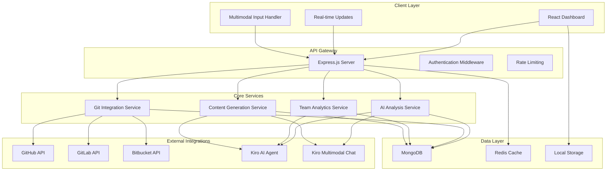
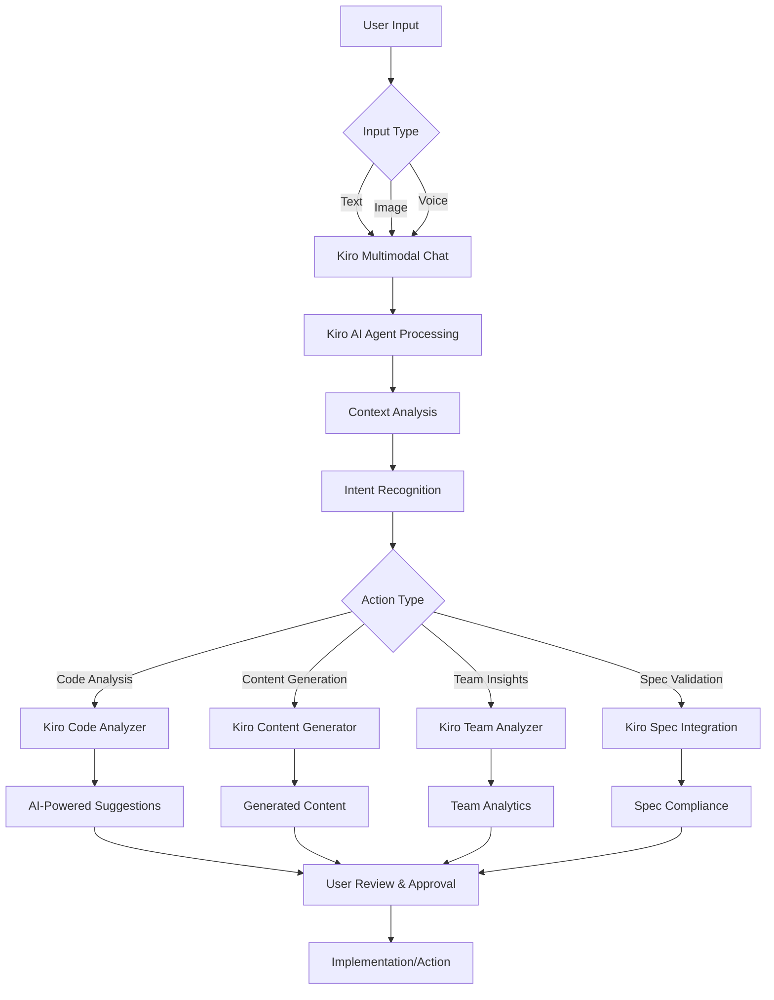
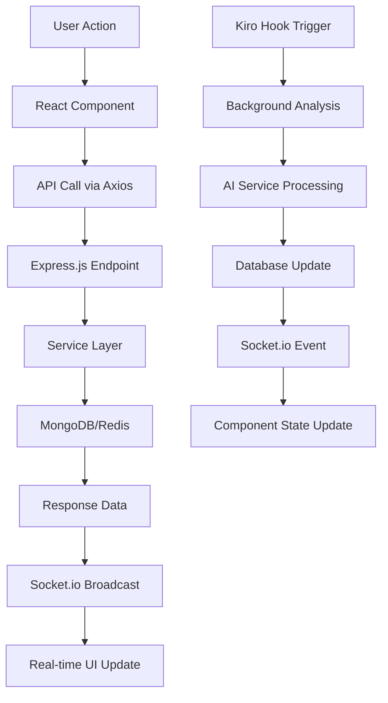

# DevSage Design Document

## Overview

DevSage is architected as a full-stack application with a React frontend, Node.js/Express backend, and MongoDB database. The system integrates with multiple Git platforms through their APIs and provides real-time AI-powered developer assistance. The architecture supports both online and offline modes, with intelligent synchronization capabilities.

The system follows a microservices-inspired modular architecture where core functionalities (AI analysis, Git integration, team analytics) are separated into distinct service layers, enabling scalability and maintainability.

**🎯 Hackathon Focus:** DevSage serves as a comprehensive showcase of Kiro's AI capabilities, demonstrating:
- **Spec-driven development** from requirements to implementation
- **Agent hooks** for automated workflow triggers
- **Multimodal AI** processing (text, voice, images)
- **Intelligent code analysis** and suggestions
- **AI-powered content generation** for Git workflows
- **Team analytics** with AI-driven insights

## Architecture

### High-Level Architecture



### Technology Stack

**Frontend:**
- React 19.1.1 with Vite for fast development
- Tailwind CSS for responsive UI design
- Axios for API communication
- WebSocket for real-time updates
- Web Speech API for voice input (with text fallback)
- Canvas API for image processing

**Backend:**
- Node.js with Express.js framework
- MongoDB with Mongoose ODM
- Redis for caching and session management
- Socket.io for real-time communication
- Multer for file upload handling
- JWT for authentication

**AI/ML Integration:**
- Kiro's AI for code analysis, PR generation, and multimodal inputs  processing (text, images, voice) using Kiro’s multimodal chat.
- Local transformer models for offline processing

**Git Platform APIs:**
- GitHub REST API v4 and GraphQL API
- GitLab REST API v4
- Bitbucket REST API 2.0
- Local Git via child_process (e.g., git diff)
- OAuth 2.0 for secure authentication

## Kiro AI Agent Integration

### Core Kiro AI Agent Features

DevSage leverages **Kiro's AI Agent** as the central intelligence engine, providing:

#### 1. **Kiro's Multimodal Chat Integration**
```javascript
// Direct integration with Kiro's multimodal capabilities
class KiroAIService {
  async processMultimodalInput(inputType, data, context) {
    // Leverage Kiro's multimodal chat for processing
    const kiroResponse = await kiro.chat.multimodal({
      type: inputType, // 'text', 'image', 'voice'
      content: data,
      context: {
        repository: context.repository,
        currentFiles: context.files,
        userIntent: context.intent
      }
    });
    
    return {
      interpretation: kiroResponse.understanding,
      suggestions: kiroResponse.recommendations,
      generatedContent: kiroResponse.output
    };
  }
}
```

#### 2. **Kiro's Code Analysis Engine**
```javascript
// Kiro AI Agent for intelligent code analysis
class KiroCodeAnalyzer {
  async analyzeCode(codeContent, filePath, repository) {
    const analysis = await kiro.analyze.code({
      content: codeContent,
      file: filePath,
      repository: repository,
      analysisTypes: ['security', 'performance', 'maintainability', 'style'],
      context: {
        teamStandards: repository.team?.codingStandards,
        projectType: repository.projectType,
        dependencies: repository.dependencies
      }
    });
    
    return {
      qualityScore: analysis.quality.score,
      suggestions: analysis.improvements.map(improvement => ({
        type: improvement.category,
        severity: improvement.priority,
        description: improvement.description,
        suggestedFix: improvement.solution,
        confidence: improvement.confidence,
        kiroReasoning: improvement.reasoning
      })),
      patterns: analysis.patterns,
      securityIssues: analysis.security.vulnerabilities
    };
  }
}
```

#### 3. **Kiro's Content Generation**
```javascript
// Kiro AI Agent for generating Git content
class KiroContentGenerator {
  async generateCommitMessage(diff, context) {
    const commitMessage = await kiro.generate.commit({
      changes: diff,
      context: {
        repository: context.repository,
        branch: context.branch,
        relatedIssues: context.issues,
        conventionalCommits: context.useConventional
      },
      style: context.user.preferences.commitStyle
    });
    
    return {
      title: commitMessage.title,
      body: commitMessage.body,
      type: commitMessage.type,
      scope: commitMessage.scope,
      kiroConfidence: commitMessage.confidence
    };
  }
  
  async generatePRContent(commits, diff, context) {
    const prContent = await kiro.generate.pullRequest({
      commits: commits,
      changes: diff,
      context: {
        repository: context.repository,
        targetBranch: context.targetBranch,
        relatedIssues: context.issues,
        teamMembers: context.team
      }
    });
    
    return {
      title: prContent.title,
      description: prContent.description,
      labels: prContent.suggestedLabels,
      reviewers: prContent.suggestedReviewers,
      kiroInsights: prContent.insights
    };
  }
}
```

#### 4. **Kiro's Team Analytics Intelligence**
```javascript
// Kiro AI Agent for team pattern analysis
class KiroTeamAnalyzer {
  async analyzeTeamPatterns(teamData, timeRange) {
    const insights = await kiro.analyze.team({
      commits: teamData.commits,
      pullRequests: teamData.prs,
      codeReviews: teamData.reviews,
      timeRange: timeRange,
      context: {
        teamSize: teamData.memberCount,
        projectTypes: teamData.repositories.map(r => r.type),
        codingStandards: teamData.standards
      }
    });
    
    return {
      strengths: insights.positivePatterns,
      improvementAreas: insights.challenges,
      recommendations: insights.actionableAdvice,
      trends: insights.temporalAnalysis,
      kiroScore: insights.teamHealthScore
    };
  }
}
```

#### 5. **Kiro's Spec-Driven Development Integration**
```javascript
// Integration with Kiro's spec-driven development
class KiroSpecIntegration {
  async generateTasksFromSpec(requirements, design) {
    const tasks = await kiro.spec.generateTasks({
      requirements: requirements,
      design: design,
      context: {
        technology: 'React + Node.js',
        database: 'MongoDB',
        deployment: 'cloud',
        teamSize: 'small'
      }
    });
    
    return {
      implementationTasks: tasks.codingTasks,
      testingTasks: tasks.testingTasks,
      dependencies: tasks.taskDependencies,
      estimatedEffort: tasks.timeEstimates,
      kiroRecommendations: tasks.bestPractices
    };
  }
  
  async validateImplementationAgainstSpec(code, specification) {
    const validation = await kiro.spec.validate({
      implementation: code,
      specification: specification,
      checkpoints: ['requirements', 'design', 'bestPractices']
    });
    
    return {
      compliance: validation.complianceScore,
      gaps: validation.missingFeatures,
      suggestions: validation.improvements,
      kiroApproval: validation.approved
    };
  }
}
```

### Kiro AI Agent Workflow Integration



### Kiro Hooks Integration (Hackathon Feature)

DevSage leverages **Kiro's Agent Hooks** for automated workflow triggers:

#### 1. **Code Quality Hook**
```markdown
# .kiro/hooks/code-quality.md
---
trigger: file_save
patterns: ["*.js", "*.jsx", "*.ts", "*.tsx"]
---

# Code Quality Hook

When code files are saved, automatically:
1. Run ESLint/Prettier formatting
2. Trigger Kiro AI code analysis
3. Generate improvement suggestions
4. Update code quality metrics
5. Notify team if critical issues found
```

#### 2. **Commit Analysis Hook**
```markdown
# .kiro/hooks/commit-analysis.md
---
trigger: git_commit
---

# Commit Analysis Hook

On every commit:
1. Analyze commit diff with Kiro AI
2. Generate enhanced commit message if needed
3. Detect potential breaking changes
4. Update changelog automatically
5. Trigger team analytics update
```

#### 3. **PR Generation Hook**
```markdown
# .kiro/hooks/pr-generation.md
---
trigger: branch_push
conditions: ["branch != main", "branch != develop"]
---

# PR Generation Hook

When pushing to feature branches:
1. Analyze all changes with Kiro AI
2. Generate PR title and description
3. Suggest reviewers based on code areas
4. Add appropriate labels
5. Create draft PR automatically
```

#### 4. **Team Insights Hook**
```markdown
# .kiro/hooks/team-insights.md
---
trigger: schedule
schedule: "0 9 * * MON"  # Every Monday at 9 AM
---

# Team Insights Hook

Weekly team analytics:
1. Analyze team coding patterns with Kiro AI
2. Generate insights and recommendations
3. Update team dashboard metrics
4. Send weekly summary to team leads
5. Identify improvement opportunities
```

### Kiro Steering Integration (Development Guidance)

DevSage uses **Kiro's Steering** for consistent development practices:

#### 1. **Coding Standards Steering**
```markdown
# .kiro/steering/coding-standards.md
---
inclusion: always
---

# DevSage Coding Standards

## React/Node.js Best Practices
- Use functional components with hooks
- Implement proper error boundaries
- Follow conventional commit format
- Maintain 80%+ test coverage
- Use TypeScript for type safety

## AI Integration Guidelines
- Always validate Kiro AI suggestions before applying
- Provide context when calling Kiro AI services
- Handle AI service failures gracefully
- Cache AI analysis results for performance
```

#### 2. **Security Practices Steering**
```markdown
# .kiro/steering/security-practices.md
---
inclusion: fileMatch
fileMatchPattern: "**/*auth*"
---

# Security Best Practices

## Authentication & Authorization
- Use JWT with proper expiration
- Implement rate limiting on auth endpoints
- Encrypt sensitive data at rest
- Validate all user inputs
- Use HTTPS in production

## Kiro AI Security
- Never send sensitive data to AI services
- Sanitize code before AI analysis
- Validate AI-generated content
- Log AI interactions for audit
```

## Components and Interfaces

### Frontend Components

#### SPA Architecture & Page Components

**Main Layout Structure:**
```javascript
// App.jsx - Single Page Application Layout
App
├── Header (fixed, user profile, notifications)
├── Sidebar (collapsible navigation, repository selector)
├── MainContent (dynamic section rendering)
│   ├── Dashboard (overview widgets)
│   ├── PRAndCommitsSection (PR/commit management)
│   ├── CodeSuggestionsPanel (improvement suggestions)
│   ├── TeamInsightsDashboard (analytics charts)
│   ├── ChangelogsView (categorized changelogs)
│   └── Settings (user preferences, Git integration)
└── NotificationCenter (real-time alerts via Socket.io)
```

**Detailed Page/Section Specifications:**

#### 1. Dashboard (Main Overview) - Dashboard.jsx
**Purpose:** Summary view with widgets for recent activity and key metrics
**Layout:** Grid-based responsive design using Tailwind CSS
```javascript
// Component structure
Dashboard
├── MetricsOverview (grid: 4 cards)
│   ├── PRMetricsCard (recent PRs count, status)
│   ├── CodeQualityGauge (average quality score)
│   ├── TestCoverageChart (coverage trend)
│   └── TeamActivityCard (commits, reviews)
├── RecentActivity (timeline)
│   ├── RecentPRs (last 5 PRs with status)
│   ├── RecentCommits (last 10 commits)
│   └── PendingSuggestions (high-priority suggestions)
└── QuickActions (floating action buttons)
    ├── CreatePRButton
    ├── AnalyzeCodeButton
    └── MultimodalInputButton

// Data sources
- CodeAnalysisSchema.quality_metrics → MetricsOverview
- CodeAnalysisSchema.generated_content → RecentActivity
- TeamSchema.metrics → TeamActivityCard
- UserSchema.preferences → Dashboard customization
```

#### 2. PRs & Commits Section - PRAndCommitsSection.jsx
**Purpose:** Manage AI-generated PRs and commits with editing capabilities
**Layout:** Tabbed interface with grid of cards
```javascript
// Component structure
PRAndCommitsSection
├── TabNavigation
│   ├── PendingPRsTab
│   ├── DraftCommitsTab
│   └── HistoryTab
├── FilterBar (by repository, status, date)
├── PRCommitGrid (responsive grid)
│   ├── PRPreviewCard[]
│   │   ├── PRTitle (editable)
│   │   ├── PRDescription (expandable, editable)
│   │   ├── FileChanges (diff preview)
│   │   ├── ActionButtons (edit, push, delete)
│   │   └── StatusBadge
│   └── CommitPreviewCard[]
│       ├── CommitMessage (editable)
│       ├── FilesChanged (summary)
│       ├── ActionButtons (edit, commit, delete)
│       └── StatusBadge
└── MultimodalInputPanel (sketch upload for PR context)

// Data sources & real-time updates
- CodeAnalysisSchema.generated_content → PR/Commit cards
- RepositorySchema → Repository filter
- Socket.io events: 'pr_generated', 'commit_ready'
- Kiro hooks: [hook:commit] triggers real-time updates
```

#### 3. Code Suggestions Panel - CodeSuggestionsPanel.jsx
**Purpose:** Display and manage code improvement suggestions with filtering
**Layout:** Sidebar filters + main suggestion list
```javascript
// Component structure
CodeSuggestionsPanel
├── SuggestionHeader
│   ├── PageTitle
│   ├── RefreshButton
│   ├── SortingOptions (severity, file, type, date)
│   └── ViewToggle (list, grid, compact)
├── SuggestionStats
│   ├── SeverityBreakdown (critical: 3, high: 7, medium: 12, low: 8)
│   ├── TypeDistribution (security: 5, performance: 8, style: 9, maintainability: 8)
│   ├── AcceptanceRate (percentage of accepted suggestions)
│   └── QualityScore (overall code quality percentage)
├── FilterSidebar
│   ├── SeverityFilter
│   │   ├── CriticalCheckbox (with count badge)
│   │   ├── HighCheckbox (with count badge)
│   │   ├── MediumCheckbox (with count badge)
│   │   └── LowCheckbox (with count badge)
│   ├── TypeFilter
│   │   ├── SecurityCheckbox (with icon and count)
│   │   ├── PerformanceCheckbox (with icon and count)
│   │   ├── StyleCheckbox (with icon and count)
│   │   └── MaintainabilityCheckbox (with icon and count)
│   ├── StatusFilter
│   │   ├── PendingCheckbox
│   │   ├── AcceptedCheckbox
│   │   ├── RejectedCheckbox
│   │   └── AppliedCheckbox
│   ├── RepositoryFilter (dropdown with search)
│   ├── AdvancedFilters
│   │   ├── DateRangeFilter (from/to dates)
│   │   ├── FilePathFilter (text input with autocomplete)
│   │   ├── AuthorFilter (who made the changes)
│   │   ├── ConfidenceFilter (AI confidence threshold)
│   │   └── LineCountFilter (affected lines range)
│   ├── SavedFilterPresets
│   │   ├── PresetList (user-saved combinations)
│   │   ├── SaveCurrentFilter
│   │   ├── LoadPreset
│   │   └── DeletePreset
│   └── FilterActions
│       ├── ClearAllFilters
│       ├── ResetToDefaults
│       └── ApplyFilters
├── BulkActionBar
│   ├── SelectionControls
│   │   ├── SelectAllCheckbox
│   │   ├── SelectAllVisible
│   │   ├── SelectBySeverity
│   │   └── SelectByType
│   ├── BulkActions
│   │   ├── BulkAcceptButton
│   │   ├── BulkRejectButton
│   │   ├── BulkApplyButton
│   │   └── BulkExportButton
│   ├── SelectionInfo (X of Y selected)
│   └── ActionConfirmation (modal for bulk operations)
├── SuggestionsList
│   ├── SuggestionItem[]
│   │   ├── SelectionCheckbox
│   │   ├── SuggestionHeader
│   │   │   ├── SeverityBadge (color-coded)
│   │   │   ├── TypeBadge (with icon)
│   │   │   ├── FileLocation (file:line)
│   │   │   ├── Timestamp
│   │   │   └── ConfidenceScore
│   │   ├── SuggestionContent
│   │   │   ├── Title (brief description)
│   │   │   ├── Description (detailed explanation)
│   │   │   ├── ImpactAnalysis (performance, security implications)
│   │   │   └── RelatedSuggestions (links to similar issues)
│   │   ├── CodePreview
│   │   │   ├── BeforeCode (current code with highlighting)
│   │   │   ├── AfterCode (suggested fix with highlighting)
│   │   │   ├── DiffViewer (side-by-side or unified)
│   │   │   └── SyntaxHighlighting
│   │   ├── SuggestionDetails (expandable)
│   │   │   ├── SecurityImplications (if security-related)
│   │   │   ├── PerformanceMetrics (if performance-related)
│   │   │   ├── BestPractices (related coding standards)
│   │   │   ├── ExternalReferences (documentation links)
│   │   │   └── SimilarIssues (in other files)
│   │   ├── ActionButtons
│   │   │   ├── AcceptButton (apply suggestion)
│   │   │   ├── RejectButton (dismiss suggestion)
│   │   │   ├── ModifyButton (edit before applying)
│   │   │   ├── MoreDetailsButton (expand full analysis)
│   │   │   ├── ShareButton (share with team)
│   │   │   └── FeedbackButton (rate suggestion quality)
│   │   └── StatusIndicator (pending, processing, applied, etc.)
│   └── LoadMoreButton (pagination)
├── SuggestionModal (detailed view)
│   ├── FullCodeContext (more lines before/after)
│   ├── MultipleFixOptions (alternative solutions)
│   ├── ImpactPreview (what changes when applied)
│   ├── TestSuggestions (recommended tests for changes)
│   ├── DocumentationUpdates (if docs need updating)
│   └── ApplyWithOptions (selective application)
└── EmptyState
    ├── NoSuggestionsMessage
    ├── AnalyzeCodeButton
    ├── FilterAdjustmentSuggestions
    └── HelpLinks

// Data sources
- CodeAnalysisSchema.suggestions → SuggestionsList
- UserSchema.preferences.suggestion_filters → Filter states
- RepositorySchema → Repository filter options
- Real-time updates via Socket.io: 'code_analysis_complete'
- TeamSchema.settings.coding_standards → Suggestion relevance
```

#### 4. Team Insights Dashboard - TeamInsightsDashboard.jsx
**Purpose:** Analytics and insights for team coding patterns
**Layout:** Chart grid with interactive visualizations
```javascript
// Component structure
TeamInsightsDashboard
├── InsightsHeader
│   ├── TeamSelector (if user is in multiple teams)
│   ├── DateRangePicker
│   └── ExportButton
├── MetricsGrid (2x2 responsive grid)
│   ├── CodingPatternsChart (Chart.js bar chart)
│   ├── QualityTrendsChart (Chart.js line chart)
│   ├── CollaborationMetrics (Chart.js pie chart)
│   └── TestCoverageHeatmap (custom visualization)
├── InsightsPanel
│   ├── StrengthsList (team's positive patterns)
│   ├── ImprovementAreas (identified issues)
│   └── Recommendations (actionable suggestions)
└── DetailedReports (expandable sections)

// Data sources
- TeamAnalyticsSchema → All charts and insights
- MongoDB aggregations on CodeAnalysisSchema.quality_metrics
- Real-time updates via Socket.io: 'team_insights_updated'
```

#### 5. Changelogs View - ChangelogsView.jsx
**Purpose:** Display categorized changelogs with version history
**Layout:** Accordion-style with timeline
```javascript
// Component structure
ChangelogsView
├── ChangelogHeader
│   ├── PageTitle
│   ├── GenerateChangelogButton
│   ├── RefreshButton
│   └── SortingOptions (latest first, oldest first, by version type)
├── ChangelogStats
│   ├── TotalVersions (count)
│   ├── NewFeatures (count across all versions)
│   ├── BugFixes (count across all versions)
│   ├── BreakingChanges (count across all versions)
│   └── LastGenerated (timestamp)
├── FilterControls
│   ├── VersionFilters
│   │   ├── AllVersionsButton
│   │   ├── MajorReleasesButton
│   │   ├── MinorUpdatesButton
│   │   ├── PatchFixesButton
│   │   └── PreReleasesButton
│   ├── ChangeTypeFilters
│   │   ├── FeaturesCheckbox
│   │   ├── BugFixesCheckbox
│   │   ├── BreakingChangesCheckbox
│   │   ├── ImprovementsCheckbox
│   │   └── SecurityFixesCheckbox
│   ├── DateRangeFilter
│   │   ├── FromDate
│   │   ├── ToDate
│   │   └── QuickRanges (last month, quarter, year)
│   └── RepositoryFilter (if multiple repos)
├── ExportManager
│   ├── ExportOptions
│   │   ├── MarkdownExporter
│   │   │   ├── TemplateSelector (GitHub, GitLab, custom)
│   │   │   ├── IncludeOptions (links, authors, dates)
│   │   │   └── DownloadButton
│   │   ├── JSONExporter
│   │   │   ├── FormatOptions (structured, flat)
│   │   │   ├── FieldSelection (which data to include)
│   │   │   └── DownloadButton
│   │   ├── PDFGenerator
│   │   │   ├── TemplateSelector (professional, minimal, detailed)
│   │   │   ├── BrandingOptions (logo, colors)
│   │   │   ├── PageOptions (header, footer, numbering)
│   │   │   └── GenerateButton
│   │   └── EmailDistribution
│   │       ├── RecipientList (team members, stakeholders)
│   │       ├── EmailTemplate (subject, body)
│   │       ├── ScheduleOptions (immediate, scheduled)
│   │       └── SendButton
│   └── ExportHistory
│       ├── RecentExports (list with download links)
│       ├── ExportStatus (in progress, completed, failed)
│       └── ReExportButton
├── VersionTimeline
│   ├── TimelineNavigation
│   │   ├── ScrollToTop
│   │   ├── ScrollToVersion (quick jump)
│   │   └── TimelineZoom (compact, normal, detailed)
│   └── VersionCard[]
│       ├── VersionHeader
│       │   ├── VersionNumber (semantic versioning)
│       │   ├── VersionType (major, minor, patch, pre-release)
│       │   ├── ReleaseDate
│       │   ├── ReleasedBy (author info)
│       │   ├── StatusBadge (draft, released, deprecated)
│       │   └── AccordionToggle
│       ├── VersionSummary
│       │   ├── ChangeCounts (features: X, fixes: Y, breaking: Z)
│       │   ├── ImpactLevel (low, medium, high)
│       │   ├── CompatibilityInfo (backward compatible, breaking)
│       │   └── ReleaseNotes (brief summary)
│       ├── ChangelogAccordion
│       │   ├── FeaturesSection
│       │   │   ├── SectionHeader (count, expand/collapse)
│       │   │   └── FeatureItem[]
│       │   │       ├── FeatureTitle
│       │   │       ├── FeatureDescription
│       │   │       ├── CommitLinks (related commits)
│       │   │       ├── IssueReferences (closes #123)
│       │   │       ├── AuthorInfo
│       │   │       ├── Timestamp
│       │   │       └── ImpactBadge
│       │   ├── BugFixesSection
│       │   │   ├── SectionHeader (count, expand/collapse)
│       │   │   └── BugFixItem[]
│       │   │       ├── BugTitle
│       │   │       ├── BugDescription
│       │   │       ├── SeverityBadge (critical, high, medium, low)
│       │   │       ├── AffectedComponents
│       │   │       ├── FixDetails
│       │   │       ├── CommitLinks
│       │   │       ├── IssueReferences
│       │   │       └── Timestamp
│       │   ├── BreakingChangesSection
│       │   │   ├── SectionHeader (highlighted, count)
│       │   │   └── BreakingChangeItem[]
│       │   │       ├── ChangeTitle
│       │   │       ├── ChangeDescription
│       │   │       ├── ImpactAnalysis (what breaks)
│       │   │       ├── MigrationGuide (how to fix)
│       │   │       ├── DeprecationWarnings
│       │   │       ├── AlternativeSolutions
│       │   │       ├── CommitLinks
│       │   │       └── Timestamp
│       │   ├── ImprovementsSection
│       │   │   ├── SectionHeader
│       │   │   └── ImprovementItem[]
│       │   │       ├── ImprovementTitle
│       │   │       ├── ImprovementDescription
│       │   │       ├── PerformanceMetrics (if applicable)
│       │   │       ├── BeforeAfterComparison
│       │   │       └── Timestamp
│       │   └── SecurityFixesSection
│       │       ├── SectionHeader (security icon)
│       │       └── SecurityFixItem[]
│       │           ├── VulnerabilityDescription
│       │           ├── SeverityScore (CVSS if applicable)
│       │           ├── AffectedVersions
│       │           ├── FixDescription
│       │           ├── SecurityAdvisory (link)
│       │           └── Timestamp
│       ├── VersionActions
│       │   ├── EditChangelogButton (if permissions)
│       │   ├── RegenerateButton (AI re-analysis)
│       │   ├── CompareVersionsButton
│       │   ├── ShareVersionButton
│       │   └── ArchiveVersionButton
│       └── VersionMetadata
│           ├── GenerationMethod (manual, AI, hybrid)
│           ├── LastModified
│           ├── ModifiedBy
│           └── ChangelogSource (commits, PRs, manual)
├── ChangelogGenerator
│   ├── GenerationOptions
│   │   ├── VersionRange (from version X to Y)
│   │   ├── IncludeOptions (commits, PRs, issues)
│   │   ├── CategoryRules (how to classify changes)
│   │   ├── TemplateSelection (format style)
│   │   └── ReviewRequired (manual review before publish)
│   ├── CommitAnalyzer
│   │   ├── CommitClassification (feature, fix, breaking)
│   │   ├── ConventionalCommits (parsing feat:, fix:, etc.)
│   │   ├── IssueExtraction (closes #123, fixes #456)
│   │   ├── AuthorAttribution
│   │   └── DuplicateDetection
│   ├── AIAnalysis
│   │   ├── ChangeImpactAssessment
│   │   ├── BreakingChangeDetection
│   │   ├── SecurityImplications
│   │   ├── PerformanceImpact
│   │   └── UserFacingChanges
│   └── GenerationPreview
│       ├── PreviewChangelog
│       ├── EditBeforePublish
│       ├── ApprovalWorkflow
│       └── PublishChangelog
├── VersionComparison
│   ├── VersionSelector (compare A vs B)
│   ├── DiffViewer
│   │   ├── AddedFeatures
│   │   ├── RemovedFeatures
│   │   ├── ModifiedFeatures
│   │   └── BreakingChanges
│   ├── MigrationGuide
│   │   ├── RequiredActions
│   │   ├── OptionalUpgrades
│   │   ├── CodeExamples
│   │   └── TroubleshootingTips
│   └── ImpactAssessment
│       ├── CompatibilityMatrix
│       ├── RiskLevel
│       ├── UpgradeEffort
│       └── RecommendedPath
└── EmptyState
    ├── NoChangelogsMessage
    ├── GenerateFirstChangelogButton
    ├── ImportChangelogButton
    └── HelpDocumentation

// Data sources
- CodeAnalysisSchema.generated_content.changelog → Changelog sections
- RepositorySchema.default_branch → Version context
- CommitSchema → Commit history for generation
- PRSchema → Pull request data for generation
- IssueSchema → Issue references and closures
- UserSchema.preferences → Display and export preferences
- Auto-generation via GitIntegrationService.generateChangelog()
```

#### 6. Authentication System - Auth Pages
**Purpose:** Complete user authentication flow with OAuth integration
**Layout:** Individual pages for each auth step

```javascript
// Authentication page structure
AuthenticationSystem
├── LoginPage.jsx
│   ├── LoginForm (email/password validation)
│   ├── OAuthButtons (GitHub, GitLab, Bitbucket)
│   ├── RememberMeToggle
│   ├── ForgotPasswordLink
│   └── SignupRedirect
├── SignupPage.jsx
│   ├── MultiStepForm (3 steps with progress indicator)
│   │   ├── Step1: AccountInfo (name, email, password with strength meter)
│   │   ├── Step2: ProfileInfo (username, job title, technologies)
│   │   └── Step3: TermsAndVerification (agreements, OAuth options)
│   ├── ProgressIndicator
│   ├── ValidationMessages
│   └── TeamInvitationBanner (if invited)
├── ForgotPasswordPage.jsx
│   ├── EmailForm (with validation)
│   ├── SuccessState (email sent confirmation)
│   ├── RateLimitState (countdown timer)
│   └── ResendFunctionality
├── ResetPasswordPage.jsx
│   ├── TokenValidation
│   ├── PasswordForm (with strength meter and confirmation)
│   ├── SuccessRedirect
│   └── ExpiredTokenHandler
├── EmailVerificationPage.jsx
│   ├── TokenProcessor
│   ├── SuccessState
│   ├── ResendVerification
│   └── ErrorHandling
├── OAuthCallbackPage.jsx
│   ├── AuthCodeProcessor
│   ├── LoadingState
│   ├── ErrorHandling
│   └── RedirectManager
└── TeamInvitationPage.jsx
    ├── InvitationValidator
    ├── TeamInfoDisplay
    ├── JoinOptions (sign in or create account)
    ├── AccountCreationForm
    └── InvalidInvitationState

// Shared Auth Components
AuthComponents
├── LoginForm.jsx
│   ├── EmailInput (with validation)
│   ├── PasswordInput (with visibility toggle)
│   ├── RememberMeCheckbox
│   ├── SubmitButton (with loading state)
│   └── ErrorDisplay
├── SignupForm.jsx
│   ├── PersonalInfoFields (first name, last name)
│   ├── EmailInput (with availability check)
│   ├── PasswordInput (with strength indicator)
│   ├── ConfirmPasswordInput
│   ├── UsernameInput (with availability check)
│   ├── TechnologySelector (checkboxes)
│   └── TermsAgreement
├── OAuthButtons.jsx
│   ├── GitHubButton
│   ├── GitLabButton
│   ├── BitbucketButton
│   └── LoadingStates
├── PasswordStrengthMeter.jsx
├── FormValidation.jsx
└── AuthErrorBoundary.jsx

// Data sources
- UserSchema → Authentication state
- TeamSchema → Team invitation context
- TeamInvitationSchema → Invitation validation
- OAuth providers → GitHub, GitLab, Bitbucket integration
```

#### 7. Settings - Settings.jsx
**Purpose:** User preferences, Git platform integration, team management
**Layout:** Tabbed settings with form sections
```javascript
// Component structure
Settings
├── SettingsTabs
│   ├── ProfileTab
│   ├── GitIntegrationTab
│   ├── AIPreferencesTab
│   ├── TeamManagementTab
│   └── OfflineModeTab
├── ProfileSettings.jsx
│   ├── PersonalInformation
│   │   ├── AvatarUpload (drag-drop, crop, validation)
│   │   ├── BasicInfo (name, email, username, job title)
│   │   ├── BioEditor (rich text editor)
│   │   └── ContactPreferences
│   ├── SecuritySettings
│   │   ├── PasswordChange (current, new, confirm)
│   │   ├── TwoFactorAuth (setup, QR code, backup codes)
│   │   ├── SessionManagement (active sessions, revoke)
│   │   ├── LoginHistory (recent logins, locations)
│   │   └── AccountDeletion (confirmation flow)
│   └── NotificationSettings
│       ├── EmailNotifications (granular controls)
│       ├── PushNotifications (browser, mobile)
│       ├── AnalysisAlerts (completion, critical issues)
│       ├── TeamNotifications (invites, updates)
│       └── WeeklySummary (digest preferences)
├── GitIntegrationSettings.jsx
│   ├── PlatformConnections
│   │   ├── GitHubCard (status, repos, permissions)
│   │   ├── GitLabCard (status, repos, permissions)
│   │   ├── BitbucketCard (status, repos, permissions)
│   │   └── LocalGitCard (path configuration)
│   ├── RepositoryManager
│   │   ├── ConnectedRepos (list with sync status)
│   │   ├── AddRepository (search, select, permissions)
│   │   ├── SyncScheduler (frequency, conflict resolution)
│   │   └── WebhookConfiguration (auto-setup, testing)
│   ├── PlatformPreferences
│   │   ├── DefaultPlatform (for new PRs)
│   │   ├── AutoSyncSettings (frequency, conditions)
│   │   ├── ConflictResolution (strategies)
│   │   └── RateLimitHandling (backoff strategies)
│   └── OAuthManagement
│       ├── TokenStatus (expiry, refresh)
│       ├── PermissionScopes (review, modify)
│       ├── ReconnectFlow (re-authorization)
│       └── TokenRevocation (disconnect)
├── AIPreferences.jsx
│   ├── SuggestionSettings
│   │   ├── EnabledTypes (security, performance, style, maintainability)
│   │   ├── SeverityThresholds (minimum levels to show)
│   │   ├── AutoApplySettings (confidence thresholds)
│   │   ├── FilterPresets (save custom filter combinations)
│   │   └── BulkActionPreferences (default behaviors)
│   ├── CommitGeneration
│   │   ├── AutoGenerateToggle
│   │   ├── ReviewRequired (always, threshold-based, never)
│   │   ├── MessageStyle (conventional, descriptive, minimal)
│   │   ├── IncludeIssueRefs (auto-detect, manual)
│   │   └── CommitTemplates (custom formats)
│   ├── PRGeneration
│   │   ├── AutoTitleGeneration
│   │   ├── DescriptionDetail (brief, detailed, comprehensive)
│   │   ├── IncludeChangelog (auto-generate)
│   │   ├── LabelSuggestions (auto-apply)
│   │   └── ReviewerSuggestions (based on code areas)
│   └── MultimodalSettings
│       ├── VoiceInput (enable, language, sensitivity)
│       ├── ImageProcessing (enable, quality, formats)
│       ├── TextCommands (enable, shortcuts)
│       ├── OfflineCapabilities (local models)
│       └── PrivacySettings (data retention, sharing)
├── TeamManagement.jsx (if team admin)
│   ├── TeamOverview
│   │   ├── TeamInfo (name, description, plan)
│   │   ├── MemberCount (active, invited, limits)
│   │   ├── RepositoryCount (connected, analyzed)
│   │   └── UsageMetrics (API calls, storage)
│   ├── MemberManagement
│   │   ├── MemberList (roles, status, last active)
│   │   ├── InviteMember (email, role, repositories)
│   │   ├── RoleManagement (permissions matrix)
│   │   ├── BulkActions (role changes, removal)
│   │   └── InvitationHistory (pending, expired)
│   ├── TeamSettings
│   │   ├── AnalyticsSharing (privacy levels)
│   │   ├── CodingStandards (rules, enforcement)
│   │   ├── QualityGates (thresholds, blocking)
│   │   ├── NotificationPolicies (team-wide settings)
│   │   └── IntegrationSettings (shared connections)
│   ├── TeamRepositories
│   │   ├── RepositoryList (access levels, analysis status)
│   │   ├── AddRepository (team-wide access)
│   │   ├── AccessControl (per-repo permissions)
│   │   ├── AnalysisSettings (team defaults)
│   │   └── SyncCoordination (avoid conflicts)
│   └── TeamAnalytics
│       ├── PrivacySettings (individual vs aggregate)
│       ├── ReportingFrequency (daily, weekly, monthly)
│       ├── MetricsSelection (which metrics to track)
│       └── ExportSettings (formats, recipients)
└── OfflineModeSettings.jsx
    ├── OfflineCapabilities
    │   ├── OfflineToggle (enable/disable)
    │   ├── FeatureAvailability (what works offline)
    │   ├── LocalModelManagement (download, update)
    │   └── StorageRequirements (disk space needed)
    ├── LocalStorageManagement
    │   ├── CacheSize (current usage, limits)
    │   ├── DataTypes (code, analysis, repos)
    │   ├── CleanupSchedule (automatic, manual)
    │   ├── RetentionPolicies (how long to keep data)
    │   └── StorageOptimization (compression, deduplication)
    ├── SyncConfiguration
    │   ├── AutoSyncTriggers (network available, schedule)
    │   ├── ConflictResolution (local vs remote priority)
    │   ├── SyncQueue (pending operations)
    │   ├── BandwidthLimits (throttling)
    │   └── SyncHistory (success/failure logs)
    └── OfflineAnalytics
        ├── UsageTracking (offline vs online time)
        ├── PerformanceMetrics (local processing speed)
        ├── SyncEfficiency (data transfer optimization)
        └── ErrorReporting (offline-specific issues)

// Data sources
- UserSchema → All user preferences and profile
- TeamSchema → Team management (if admin)
- RepositorySchema → Git integration status
- TeamInvitationSchema → Invitation management
- CodeAnalysisSchema → AI preferences and history
```

**Specialized Input Components:**
```javascript
// MultimodalInput - Used across multiple sections
MultimodalInput
├── TextInput (natural language commands)
│   └── CommandProcessor (parse intents like "Create PR for login feature")
├── VoiceInput (speech-to-text processing)
│   ├── WebSpeechAPI (browser support)
│   ├── TranscriptionDisplay (real-time text)
│   └── FallbackTextInput (if voice unavailable)
├── ImageUpload (sketch/mockup analysis)
│   ├── CanvasPreprocessor (image optimization)
│   ├── SketchAnalyzer (extract UI elements)
│   └── PRContextGenerator (generate PR descriptions from sketches)
└── FileDropZone (drag-and-drop interface)
    ├── FileValidator (type, size checks)
    ├── PreviewGenerator (thumbnails)
    └── ProcessingQueue (batch processing)
```

#### Real-time Update System
```javascript
// WebSocket connection manager
class RealtimeManager {
  constructor() {
    this.socket = io('ws://localhost:5000');
    this.subscriptions = new Map();
  }
  
  subscribe(event, callback) {
    this.socket.on(event, callback);
    this.subscriptions.set(event, callback);
  }
  
  emit(event, data) {
    this.socket.emit(event, data);
  }
}

// Event types for real-time updates
const EVENTS = {
  CODE_ANALYSIS_COMPLETE: 'code_analysis_complete',
  PR_GENERATED: 'pr_generated',
  TEAM_INSIGHTS_UPDATED: 'team_insights_updated',
  SYNC_STATUS_CHANGED: 'sync_status_changed'
};
```

### Backend Services

#### AI Analysis Service
```javascript
class AIAnalysisService {
  async analyzeCode(codeContent, filePath, changeType) {
    // Analyze code for improvements, patterns, and issues
    const analysis = await this.processWithAI(codeContent);
    return {
      suggestions: analysis.improvements,
      quality_score: analysis.score,
      issues: analysis.detected_issues,
      patterns: analysis.code_patterns
    };
  }
  
  async generateCommitMessage(diff, context) {
    // Generate descriptive commit messages from git diff
    const prompt = this.buildCommitPrompt(diff, context);
    return await this.callAIService(prompt);
  }
  
  async generatePRContent(commits, diff, context) {
    // Create PR titles and descriptions
    const analysis = await this.analyzePRChanges(commits, diff);
    return {
      title: analysis.suggested_title,
      description: analysis.detailed_description,
      labels: analysis.suggested_labels
    };
  }

  async processMultimodalInput(inputType, data) {
    // Process text, image, or voice inputs for PRs or suggestions using Kiro multimodal chat:
        // **Text**: Parses natural language commands (e.g., “Create PR for login feature”) via Kiro’s chat.
        // **Image**: Analyzes sketches/mockups via Canvas API preprocessing and Kiro’s chat (e.g., prompt: “Describe code changes based on this UI sketch: ${imageData}”).
        // **Voice**: Converts speech to text via Web Speech API, then processes via Kiro’s chat.
        // Returns PR content, code suggestions, or commands based on input.
        // Offline: Uses DistilBERT for text/image analysis when no internet is available.
  }
}
```

#### Git Integration Service
```javascript
class GitIntegrationService {
  constructor() {
    this.platforms = {
      github: new GitHubAdapter(),
      gitlab: new GitLabAdapter(),
      bitbucket: new BitbucketAdapter()
    };
  }
  
  async createPullRequest(platform, repoData, prContent) {
    const adapter = this.platforms[platform];
    return await adapter.createPR(repoData, prContent);
  }
  
  async syncRepository(platform, repoId) {
    const adapter = this.platforms[platform];
    const repoData = await adapter.fetchRepository(repoId);
    await this.updateLocalCache(repoData);
    return repoData;
  }

  async generateChangelog(commits, version) {
    // crates categorized changelogs:
        // Analyzes commits using Kiro’s AI with prompt: “Categorize these commits into Features, Bug Fixes, Breaking Changes: ${commits}.”
        // Features: Commits with keywords like “add,” “implement,” “new.”
        // Bug Fixes: Commits with keywords like “fix,” “resolve,” “bug.”
        // Breaking Changes: Commits with keywords like “remove,” “deprecate,” or flagged by Kiro’s AI as impactful.
        // Formats output as markdown (e.g., “## v${version}\n### Features\n- ${description} (${timestamp})”).
        // Stores in MongoDB and emits `CHANGELOG_UPDATED` event.
  }
}

// Platform-specific adapters
class GitHubAdapter {
  async createPR(repoData, prContent) {
    const response = await this.githubAPI.post('/repos/{owner}/{repo}/pulls', {
      title: prContent.title,
      body: prContent.description,
      head: prContent.branch,
      base: prContent.target_branch
    });
    return response.data;
  }
}
```

#### Team Analytics Service
```javascript
class TeamAnalyticsService {
  async analyzeTeamPatterns(teamId, timeRange) {
    const commits = await this.getTeamCommits(teamId, timeRange);
    const prs = await this.getTeamPRs(teamId, timeRange);
    
    return {
      coding_patterns: await this.analyzeCodingPatterns(commits),
      collaboration_metrics: await this.analyzeCollaboration(prs),
      quality_trends: await this.analyzeQualityTrends(commits),
      recommendations: await this.generateRecommendations(commits, prs)
    };
  }
  
  async generateTeamInsights(analysisData) {
    // Produces strengths, improvement areas, suggested practices, and metrics, displayed in dashboard charts.
    return {
      strengths: analysisData.positive_patterns,
      improvement_areas: analysisData.issues,
      suggested_practices: analysisData.recommendations,
      metrics: analysisData.quantitative_data
    };
  }
}

#### Authentication Service
```javascript
class AuthenticationService {
  async register(userData, inviteToken = null) {
    // Validate user data
    await this.validateRegistrationData(userData);
    
    // Check if email already exists
    const existingUser = await User.findOne({ email: userData.email });
    if (existingUser) {
      throw new Error('Email already registered');
    }
    
    // Hash password
    const passwordHash = await bcrypt.hash(userData.password, 12);
    
    // Create user
    const user = new User({
      ...userData,
      password_hash: passwordHash,
      email_verification_token: crypto.randomBytes(32).toString('hex'),
      email_verification_expires: Date.now() + 24 * 60 * 60 * 1000 // 24 hours
    });
    
    await user.save();
    
    // Handle team invitation if present
    if (inviteToken) {
      await this.processTeamInvitation(user._id, inviteToken);
    }
    
    // Send verification email
    await this.emailService.sendVerificationEmail(user);
    
    return { user: this.sanitizeUser(user), requiresVerification: true };
  }

  async login(credentials) {
    const { email, password, rememberMe } = credentials;
    
    // Find user
    const user = await User.findOne({ email }).select('+password_hash');
    if (!user) {
      throw new Error('Invalid credentials');
    }
    
    // Verify password
    const isValidPassword = await bcrypt.compare(password, user.password_hash);
    if (!isValidPassword) {
      throw new Error('Invalid credentials');
    }
    
    // Check if email is verified
    if (!user.email_verified) {
      throw new Error('Email not verified');
    }
    
    // Generate tokens
    const accessToken = this.generateAccessToken(user._id);
    const refreshToken = this.generateRefreshToken(user._id);
    
    // Save refresh token
    await this.saveRefreshToken(user._id, refreshToken, rememberMe);
    
    // Update last login
    user.last_login = new Date();
    await user.save();
    
    return {
      user: this.sanitizeUser(user),
      accessToken,
      refreshToken: rememberMe ? refreshToken : undefined
    };
  }

  async forgotPassword(email) {
    const user = await User.findOne({ email });
    if (!user) {
      // Don't reveal if email exists
      return { message: 'If email exists, reset instructions sent' };
    }
    
    // Check rate limiting
    await this.checkPasswordResetRateLimit(email);
    
    // Generate reset token
    const resetToken = crypto.randomBytes(32).toString('hex');
    const resetExpires = Date.now() + 60 * 60 * 1000; // 1 hour
    
    user.password_reset_token = resetToken;
    user.password_reset_expires = resetExpires;
    await user.save();
    
    // Send reset email
    await this.emailService.sendPasswordResetEmail(user, resetToken);
    
    return { message: 'Reset instructions sent' };
  }

  async resetPassword(token, newPassword) {
    const user = await User.findOne({
      password_reset_token: token,
      password_reset_expires: { $gt: Date.now() }
    });
    
    if (!user) {
      throw new Error('Invalid or expired reset token');
    }
    
    // Validate new password
    await this.validatePassword(newPassword);
    
    // Hash new password
    const passwordHash = await bcrypt.hash(newPassword, 12);
    
    // Update user
    user.password_hash = passwordHash;
    user.password_reset_token = undefined;
    user.password_reset_expires = undefined;
    await user.save();
    
    // Revoke all existing sessions
    await this.revokeAllSessions(user._id);
    
    return { message: 'Password reset successful' };
  }

  async verifyEmail(token) {
    const user = await User.findOne({
      email_verification_token: token,
      email_verification_expires: { $gt: Date.now() }
    });
    
    if (!user) {
      throw new Error('Invalid or expired verification token');
    }
    
    user.email_verified = true;
    user.email_verification_token = undefined;
    user.email_verification_expires = undefined;
    await user.save();
    
    return { message: 'Email verified successfully' };
  }

  async setup2FA(userId) {
    const user = await User.findById(userId);
    if (!user) {
      throw new Error('User not found');
    }
    
    const secret = speakeasy.generateSecret({
      name: `DevSage (${user.email})`,
      issuer: 'DevSage'
    });
    
    // Store temporary secret
    user.temp_2fa_secret = secret.base32;
    await user.save();
    
    return {
      secret: secret.base32,
      qrCode: await QRCode.toDataURL(secret.otpauth_url),
      backupCodes: this.generateBackupCodes()
    };
  }

  async validateSession(token) {
    try {
      const decoded = jwt.verify(token, process.env.JWT_SECRET);
      const user = await User.findById(decoded.userId);
      
      if (!user) {
        throw new Error('User not found');
      }
      
      return this.sanitizeUser(user);
    } catch (error) {
      throw new Error('Invalid token');
    }
  }

  async revokeSession(sessionId, userId) {
    await RefreshToken.deleteOne({ _id: sessionId, user_id: userId });
    return { message: 'Session revoked' };
  }

  async processTeamInvitation(userId, inviteToken) {
    const invitation = await TeamInvitation.findOne({
      token: inviteToken,
      status: 'pending',
      expires_at: { $gt: Date.now() }
    });
    
    if (!invitation) {
      throw new Error('Invalid or expired invitation');
    }
    
    // Add user to team
    const team = await Team.findById(invitation.team_id);
    team.members.push({
      user_id: userId,
      role: invitation.role,
      joined_at: new Date()
    });
    await team.save();
    
    // Update user
    const user = await User.findById(userId);
    user.team_memberships.push({
      team_id: invitation.team_id,
      role: invitation.role,
      joined_at: new Date()
    });
    await user.save();
    
    // Update invitation
    invitation.status = 'accepted';
    invitation.accepted_at = new Date();
    invitation.accepted_by = userId;
    await invitation.save();
    
    return { team, role: invitation.role };
  }
}

#### OAuth Service
```javascript
class OAuthService {
  constructor() {
    this.providers = {
      github: new GitHubOAuthProvider(),
      gitlab: new GitLabOAuthProvider(),
      bitbucket: new BitbucketOAuthProvider()
    };
  }

  async initiateOAuth(platform, redirectUri) {
    const provider = this.providers[platform];
    if (!provider) {
      throw new Error(`Unsupported OAuth platform: ${platform}`);
    }
    
    const state = crypto.randomBytes(32).toString('hex');
    const authUrl = provider.getAuthUrl(redirectUri, state);
    
    // Store state for validation
    await this.storeOAuthState(state, platform, redirectUri);
    
    return { authUrl, state };
  }

  async handleCallback(platform, code, state) {
    // Validate state
    const storedState = await this.validateOAuthState(state);
    if (!storedState || storedState.platform !== platform) {
      throw new Error('Invalid OAuth state');
    }
    
    const provider = this.providers[platform];
    
    // Exchange code for tokens
    const tokens = await provider.exchangeCodeForTokens(code);
    
    // Get user info from provider
    const providerUser = await provider.getUserInfo(tokens.access_token);
    
    // Find or create user
    let user = await User.findOne({ email: providerUser.email });
    
    if (!user) {
      // Create new user
      user = new User({
        email: providerUser.email,
        username: providerUser.username,
        profile: {
          name: providerUser.name,
          avatar_url: providerUser.avatar_url
        },
        email_verified: true, // OAuth emails are pre-verified
        platforms: [{
          platform,
          platform_user_id: providerUser.id,
          access_token: await this.encryptToken(tokens.access_token),
          refresh_token: tokens.refresh_token ? await this.encryptToken(tokens.refresh_token) : null,
          connected_at: new Date()
        }]
      });
    } else {
      // Update existing user's platform connection
      const existingPlatform = user.platforms.find(p => p.platform === platform);
      if (existingPlatform) {
        existingPlatform.access_token = await this.encryptToken(tokens.access_token);
        existingPlatform.refresh_token = tokens.refresh_token ? await this.encryptToken(tokens.refresh_token) : null;
        existingPlatform.last_sync = new Date();
      } else {
        user.platforms.push({
          platform,
          platform_user_id: providerUser.id,
          access_token: await this.encryptToken(tokens.access_token),
          refresh_token: tokens.refresh_token ? await this.encryptToken(tokens.refresh_token) : null,
          connected_at: new Date()
        });
      }
    }
    
    await user.save();
    
    // Generate our own tokens
    const accessToken = this.generateAccessToken(user._id);
    const refreshToken = this.generateRefreshToken(user._id);
    
    return {
      user: this.sanitizeUser(user),
      accessToken,
      refreshToken,
      isNewUser: !user.createdAt
    };
  }

  async refreshTokens(userId, platform) {
    const user = await User.findById(userId);
    const platformData = user.platforms.find(p => p.platform === platform);
    
    if (!platformData || !platformData.refresh_token) {
      throw new Error('No refresh token available');
    }
    
    const provider = this.providers[platform];
    const decryptedRefreshToken = await this.decryptToken(platformData.refresh_token);
    
    try {
      const newTokens = await provider.refreshTokens(decryptedRefreshToken);
      
      // Update stored tokens
      platformData.access_token = await this.encryptToken(newTokens.access_token);
      if (newTokens.refresh_token) {
        platformData.refresh_token = await this.encryptToken(newTokens.refresh_token);
      }
      platformData.last_sync = new Date();
      
      await user.save();
      
      return newTokens;
    } catch (error) {
      // Refresh failed, mark platform as disconnected
      platformData.access_token = null;
      platformData.refresh_token = null;
      await user.save();
      
      throw new Error('Token refresh failed, re-authentication required');
    }
  }
}

#### Email Service
```javascript
class EmailService {
  constructor() {
    this.transporter = nodemailer.createTransporter({
      host: process.env.SMTP_HOST,
      port: process.env.SMTP_PORT,
      secure: process.env.SMTP_SECURE === 'true',
      auth: {
        user: process.env.SMTP_USER,
        pass: process.env.SMTP_PASS
      }
    });
    
    this.templates = {
      verification: new EmailTemplate('verification'),
      passwordReset: new EmailTemplate('password-reset'),
      teamInvitation: new EmailTemplate('team-invitation'),
      notification: new EmailTemplate('notification')
    };
  }

  async sendVerificationEmail(user) {
    const verificationUrl = `${process.env.FRONTEND_URL}/verify-email?token=${user.email_verification_token}`;
    
    const html = await this.templates.verification.render({
      name: user.profile.name || user.username,
      verificationUrl,
      expiresIn: '24 hours'
    });
    
    await this.transporter.sendMail({
      from: process.env.FROM_EMAIL,
      to: user.email,
      subject: 'Verify your DevSage account',
      html
    });
  }

  async sendPasswordResetEmail(user, resetToken) {
    const resetUrl = `${process.env.FRONTEND_URL}/reset-password?token=${resetToken}`;
    
    const html = await this.templates.passwordReset.render({
      name: user.profile.name || user.username,
      resetUrl,
      expiresIn: '1 hour'
    });
    
    await this.transporter.sendMail({
      from: process.env.FROM_EMAIL,
      to: user.email,
      subject: 'Reset your DevSage password',
      html
    });
  }

  async sendTeamInvitation(invitation, team, inviter) {
    const inviteUrl = `${process.env.FRONTEND_URL}/team-invitation?token=${invitation.token}`;
    
    const html = await this.templates.teamInvitation.render({
      teamName: team.name,
      inviterName: inviter.profile.name || inviter.username,
      role: invitation.role,
      inviteUrl,
      expiresIn: '7 days'
    });
    
    await this.transporter.sendMail({
      from: process.env.FROM_EMAIL,
      to: invitation.email,
      subject: `You're invited to join ${team.name} on DevSage`,
      html
    });
  }

  async sendNotificationEmail(user, notification) {
    if (!user.profile.preferences.notification_settings.email_enabled) {
      return; // User has disabled email notifications
    }
    
    const html = await this.templates.notification.render({
      name: user.profile.name || user.username,
      notification
    });
    
    await this.transporter.sendMail({
      from: process.env.FROM_EMAIL,
      to: user.email,
      subject: notification.subject,
      html
    });
  }
}

#### File Upload Service
```javascript
class FileUploadService {
  constructor() {
    this.storage = multer.diskStorage({
      destination: (req, file, cb) => {
        const uploadPath = path.join(process.env.UPLOAD_DIR, req.user.id);
        fs.ensureDirSync(uploadPath);
        cb(null, uploadPath);
      },
      filename: (req, file, cb) => {
        const uniqueName = `${Date.now()}-${crypto.randomBytes(6).toString('hex')}${path.extname(file.originalname)}`;
        cb(null, uniqueName);
      }
    });
    
    this.upload = multer({
      storage: this.storage,
      limits: {
        fileSize: 10 * 1024 * 1024, // 10MB
        files: 5
      },
      fileFilter: this.fileFilter.bind(this)
    });
  }

  fileFilter(req, file, cb) {
    const allowedTypes = {
      image: ['image/jpeg', 'image/png', 'image/gif', 'image/webp'],
      audio: ['audio/wav', 'audio/mp3', 'audio/ogg', 'audio/webm'],
      document: ['application/pdf', 'text/plain', 'text/markdown']
    };
    
    const isAllowed = Object.values(allowedTypes).flat().includes(file.mimetype);
    
    if (isAllowed) {
      cb(null, true);
    } else {
      cb(new Error(`File type ${file.mimetype} not allowed`), false);
    }
  }

  async uploadImage(file, userId) {
    // Validate image
    await this.validateImageFile(file);
    
    // Optimize image
    const optimizedPath = await this.optimizeImage(file.path);
    
    // Generate metadata
    const metadata = await this.extractImageMetadata(optimizedPath);
    
    // Store in database
    const fileRecord = new UploadedFile({
      user_id: userId,
      original_name: file.originalname,
      file_path: optimizedPath,
      file_type: 'image',
      mime_type: file.mimetype,
      file_size: fs.statSync(optimizedPath).size,
      metadata
    });
    
    await fileRecord.save();
    
    return {
      id: fileRecord._id,
      url: `/uploads/${userId}/${path.basename(optimizedPath)}`,
      metadata
    };
  }

  async processVoiceInput(audioFile) {
    // Validate audio file
    await this.validateAudioFile(audioFile);
    
    // Convert to standard format if needed
    const processedPath = await this.convertAudio(audioFile.path);
    
    // Extract audio metadata
    const metadata = await this.extractAudioMetadata(processedPath);
    
    // Transcribe using speech-to-text service
    const transcription = await this.transcribeAudio(processedPath);
    
    return {
      file_path: processedPath,
      duration: metadata.duration,
      transcription: transcription.text,
      confidence: transcription.confidence,
      metadata
    };
  }

  async optimizeImage(imagePath) {
    const outputPath = imagePath.replace(/\.[^/.]+$/, '_optimized.webp');
    
    await sharp(imagePath)
      .resize(1920, 1080, { 
        fit: 'inside',
        withoutEnlargement: true 
      })
      .webp({ quality: 85 })
      .toFile(outputPath);
    
    // Remove original if optimization successful
    fs.unlinkSync(imagePath);
    
    return outputPath;
  }

  async validateFileType(file) {
    const fileType = await FileType.fromFile(file.path);
    
    if (!fileType || fileType.mime !== file.mimetype) {
      throw new Error('File type mismatch or invalid file');
    }
    
    return fileType;
  }
}

#### Notification Service
```javascript
class NotificationService {
  constructor() {
    this.io = null; // Will be set by Socket.io instance
  }

  setSocketIO(io) {
    this.io = io;
  }

  async createNotification(userId, type, data) {
    const notification = new Notification({
      user_id: userId,
      type,
      title: data.title,
      message: data.message,
      data: data.metadata || {},
      read: false
    });
    
    await notification.save();
    
    // Send real-time notification
    await this.sendRealTimeNotification(userId, notification);
    
    // Send email if enabled
    const user = await User.findById(userId);
    if (this.shouldSendEmail(user, type)) {
      await this.emailService.sendNotificationEmail(user, notification);
    }
    
    return notification;
  }

  async markAsRead(notificationId, userId) {
    const notification = await Notification.findOneAndUpdate(
      { _id: notificationId, user_id: userId },
      { read: true, read_at: new Date() },
      { new: true }
    );
    
    if (!notification) {
      throw new Error('Notification not found');
    }
    
    // Update unread count
    const unreadCount = await this.getUnreadCount(userId);
    this.io.to(`user_${userId}`).emit('unread_count_updated', { count: unreadCount });
    
    return notification;
  }

  async getUnreadCount(userId) {
    return await Notification.countDocuments({
      user_id: userId,
      read: false
    });
  }

  async sendRealTimeNotification(userId, notification) {
    if (this.io) {
      this.io.to(`user_${userId}`).emit('new_notification', {
        id: notification._id,
        type: notification.type,
        title: notification.title,
        message: notification.message,
        timestamp: notification.createdAt
      });
      
      // Update unread count
      const unreadCount = await this.getUnreadCount(userId);
      this.io.to(`user_${userId}`).emit('unread_count_updated', { count: unreadCount });
    }
  }

  shouldSendEmail(user, notificationType) {
    const emailSettings = user.profile.preferences.notification_settings;
    
    if (!emailSettings.email_enabled) return false;
    
    const typeSettings = {
      'analysis_complete': emailSettings.analysis_complete,
      'pr_generated': emailSettings.pr_generated,
      'team_insights': emailSettings.team_insights,
      'security_alert': true, // Always send security alerts
      'system_update': emailSettings.system_updates || false
    };
    
    return typeSettings[notificationType] || false;
  }
}

#### Export Service
```javascript
class ExportService {
  async exportToMarkdown(changelogData, options = {}) {
    const template = options.template || 'github';
    const includeLinks = options.includeLinks !== false;
    const includeAuthors = options.includeAuthors !== false;
    const includeDates = options.includeDates !== false;
    
    let markdown = `# Changelog\n\n`;
    
    if (options.description) {
      markdown += `${options.description}\n\n`;
    }
    
    for (const version of changelogData.versions) {
      markdown += `## [${version.version}]`;
      
      if (includeLinks && version.compareUrl) {
        markdown += `(${version.compareUrl})`;
      }
      
      if (includeDates) {
        markdown += ` - ${version.date}`;
      }
      
      markdown += `\n\n`;
      
      // Features
      if (version.features.length > 0) {
        markdown += `### Added\n\n`;
        for (const feature of version.features) {
          markdown += `- ${feature.description}`;
          if (includeAuthors && feature.author) {
            markdown += ` ([@${feature.author}](${feature.authorUrl}))`;
          }
          markdown += `\n`;
        }
        markdown += `\n`;
      }
      
      // Bug fixes
      if (version.bugFixes.length > 0) {
        markdown += `### Fixed\n\n`;
        for (const fix of version.bugFixes) {
          markdown += `- ${fix.description}`;
          if (includeAuthors && fix.author) {
            markdown += ` ([@${fix.author}](${fix.authorUrl}))`;
          }
          markdown += `\n`;
        }
        markdown += `\n`;
      }
      
      // Breaking changes
      if (version.breakingChanges.length > 0) {
        markdown += `### BREAKING CHANGES\n\n`;
        for (const change of version.breakingChanges) {
          markdown += `- **${change.title}**: ${change.description}`;
          if (change.migrationGuide) {
            markdown += `\n  \n  Migration: ${change.migrationGuide}`;
          }
          markdown += `\n`;
        }
        markdown += `\n`;
      }
    }
    
    return markdown;
  }

  async exportToJSON(changelogData, options = {}) {
    const format = options.format || 'structured';
    
    if (format === 'flat') {
      // Flat structure for simple consumption
      const entries = [];
      
      for (const version of changelogData.versions) {
        for (const feature of version.features) {
          entries.push({
            version: version.version,
            date: version.date,
            type: 'feature',
            description: feature.description,
            author: feature.author
          });
        }
        
        for (const fix of version.bugFixes) {
          entries.push({
            version: version.version,
            date: version.date,
            type: 'bugfix',
            description: fix.description,
            author: fix.author
          });
        }
        
        for (const change of version.breakingChanges) {
          entries.push({
            version: version.version,
            date: version.date,
            type: 'breaking',
            title: change.title,
            description: change.description,
            migrationGuide: change.migrationGuide
          });
        }
      }
      
      return JSON.stringify(entries, null, 2);
    }
    
    // Structured format (default)
    return JSON.stringify(changelogData, null, 2);
  }

  async generatePDF(changelogData, options = {}) {
    const template = options.template || 'professional';
    const includeBranding = options.includeBranding !== false;
    
    const html = await this.generateHTMLForPDF(changelogData, {
      template,
      includeBranding,
      ...options
    });
    
    const pdf = await puppeteer.launch().then(async browser => {
      const page = await browser.newPage();
      await page.setContent(html);
      
      const pdfBuffer = await page.pdf({
        format: 'A4',
        margin: {
          top: '20mm',
          right: '20mm',
          bottom: '20mm',
          left: '20mm'
        },
        displayHeaderFooter: true,
        headerTemplate: options.headerTemplate || '',
        footerTemplate: options.footerTemplate || '<div style="font-size: 10px; text-align: center; width: 100%;">Page <span class="pageNumber"></span> of <span class="totalPages"></span></div>'
      });
      
      await browser.close();
      return pdfBuffer;
    });
    
    return pdf;
  }

  async emailChangelog(recipients, changelog, format = 'markdown') {
    let content;
    let attachment;
    
    switch (format) {
      case 'markdown':
        content = await this.exportToMarkdown(changelog);
        attachment = {
          filename: 'changelog.md',
          content: content,
          contentType: 'text/markdown'
        };
        break;
        
      case 'pdf':
        const pdfBuffer = await this.generatePDF(changelog);
        attachment = {
          filename: 'changelog.pdf',
          content: pdfBuffer,
          contentType: 'application/pdf'
        };
        content = 'Please find the changelog attached.';
        break;
        
      default:
        content = await this.exportToMarkdown(changelog);
    }
    
    for (const recipient of recipients) {
      await this.emailService.transporter.sendMail({
        from: process.env.FROM_EMAIL,
        to: recipient.email,
        subject: `Changelog - Version ${changelog.versions[0]?.version}`,
        text: content,
        attachments: attachment ? [attachment] : []
      });
    }
  }
}

#### Team Invitation Service
```javascript
class TeamInvitationService {
  async createInvitation(teamId, email, role, inviterId) {
    // Validate team exists and inviter has permission
    const team = await Team.findById(teamId);
    if (!team) {
      throw new Error('Team not found');
    }
    
    const inviterMembership = team.members.find(m => m.user_id.toString() === inviterId);
    if (!inviterMembership || inviterMembership.role !== 'admin') {
      throw new Error('Insufficient permissions to invite members');
    }
    
    // Check if user is already a member
    const existingUser = await User.findOne({ email });
    if (existingUser) {
      const existingMembership = existingUser.team_memberships.find(
        m => m.team_id.toString() === teamId
      );
      if (existingMembership) {
        throw new Error('User is already a team member');
      }
    }
    
    // Check for existing pending invitation
    const existingInvitation = await TeamInvitation.findOne({
      team_id: teamId,
      email,
      status: 'pending'
    });
    
    if (existingInvitation) {
      throw new Error('Invitation already sent to this email');
    }
    
    // Create invitation
    const invitation = new TeamInvitation({
      team_id: teamId,
      inviter_id: inviterId,
      email,
      role,
      token: crypto.randomBytes(32).toString('hex'),
      expires_at: new Date(Date.now() + 7 * 24 * 60 * 60 * 1000) // 7 days
    });
    
    await invitation.save();
    
    // Send invitation email
    const inviter = await User.findById(inviterId);
    await this.emailService.sendTeamInvitation(invitation, team, inviter);
    
    return invitation;
  }

  async validateInvitation(token) {
    const invitation = await TeamInvitation.findOne({
      token,
      status: 'pending',
      expires_at: { $gt: new Date() }
    }).populate('team_id').populate('inviter_id');
    
    if (!invitation) {
      return { valid: false, reason: 'Invalid or expired invitation' };
    }
    
    return {
      valid: true,
      invitation: {
        id: invitation._id,
        team: {
          id: invitation.team_id._id,
          name: invitation.team_id.name,
          description: invitation.team_id.description,
          memberCount: invitation.team_id.members.length
        },
        role: invitation.role,
        inviter: {
          name: invitation.inviter_id.profile.name || invitation.inviter_id.username,
          email: invitation.inviter_id.email
        },
        expiresAt: invitation.expires_at
      }
    };
  }

  async acceptInvitation(token, userData = null) {
    const validation = await this.validateInvitation(token);
    if (!validation.valid) {
      throw new Error(validation.reason);
    }
    
    const invitation = await TeamInvitation.findOne({ token });
    
    // Check if user exists
    let user = await User.findOne({ email: invitation.email });
    
    if (!user && userData) {
      // Create new user account
      user = await this.authService.register({
        ...userData,
        email: invitation.email
      });
    } else if (!user) {
      throw new Error('User account required to accept invitation');
    }
    
    // Add user to team
    const team = await Team.findById(invitation.team_id);
    team.members.push({
      user_id: user._id,
      role: invitation.role,
      joined_at: new Date()
    });
    await team.save();
    
    // Update user
    user.team_memberships.push({
      team_id: invitation.team_id,
      role: invitation.role,
      joined_at: new Date()
    });
    await user.save();
    
    // Update invitation
    invitation.status = 'accepted';
    invitation.accepted_at = new Date();
    invitation.accepted_by = user._id;
    await invitation.save();
    
    // Create notification for team admins
    const teamAdmins = team.members.filter(m => m.role === 'admin');
    for (const admin of teamAdmins) {
      await this.notificationService.createNotification(admin.user_id, 'team_member_joined', {
        title: 'New team member',
        message: `${user.profile.name || user.username} joined ${team.name}`,
        metadata: { teamId: team._id, userId: user._id }
      });
    }
    
    return { user, team, role: invitation.role };
  }
}
```

#### Component Data Flow & Interactions

**Real-time Data Flow:**


**Cross-Component Communication:**
```javascript
// Global state management using React Context
const AppContext = createContext({
  user: null,
  currentRepository: null,
  notifications: [],
  offlineMode: false,
  realtimeConnection: null
});

// Component interaction patterns
const componentInteractions = {
  // Header → All sections (user context, notifications)
  Header: {
    provides: ['user', 'notifications', 'currentRepository'],
    triggers: ['logout', 'repositoryChange', 'notificationRead']
  },
  
  // Sidebar → MainContent (navigation, repository selection)
  Sidebar: {
    provides: ['currentSection', 'repositoryFilter'],
    triggers: ['sectionChange', 'repositorySelect']
  },
  
  // PRAndCommitsSection → CodeSuggestionsPanel (code analysis triggers)
  PRAndCommitsSection: {
    triggers: ['codeAnalysisRequest', 'prCreated'],
    listens: ['analysisComplete', 'suggestionsGenerated']
  },
  
  // Settings → All sections (preference changes)
  Settings: {
    triggers: ['preferencesUpdated', 'gitIntegrationChanged'],
    affects: ['Dashboard', 'PRAndCommitsSection', 'CodeSuggestionsPanel']
  },
  
  // MultimodalInput → Multiple sections (context-aware processing)
  MultimodalInput: {
    context_aware: true,
    triggers: ['textCommand', 'voiceCommand', 'imageAnalysis'],
    processes_for: ['PRAndCommitsSection', 'CodeSuggestionsPanel']
  }
};
```

**Mobile Responsiveness Strategy:**
```javascript
// Tailwind CSS responsive breakpoints
const responsiveDesign = {
  mobile: 'sm:hidden md:block', // Hide sidebar on mobile, show hamburger
  tablet: 'md:grid-cols-2 lg:grid-cols-3', // Adjust grid layouts
  desktop: 'lg:grid-cols-4 xl:grid-cols-5', // Full feature display
  
  // Component-specific responsive behavior
  Dashboard: {
    mobile: 'Single column, stacked cards',
    tablet: '2-column grid',
    desktop: '4-column grid with sidebar'
  },
  
  PRAndCommitsSection: {
    mobile: 'List view, expandable cards',
    tablet: '2-column grid',
    desktop: '3-column grid with filters'
  },
  
  TeamInsightsDashboard: {
    mobile: 'Stacked charts, simplified metrics',
    tablet: '2x2 chart grid',
    desktop: 'Full dashboard with detailed insights'
  }
};
```

### API Endpoints

#### Core API Routes
```javascript
// Authentication and user management
POST /api/auth/register                    // User registration with optional team invitation
POST /api/auth/login                       // User login with credentials
POST /api/auth/logout                      // User logout and token invalidation
POST /api/auth/refresh                     // Refresh access token
POST /api/auth/forgot-password             // Request password reset
POST /api/auth/reset-password              // Reset password with token
POST /api/auth/verify-email                // Verify email with token
POST /api/auth/resend-verification         // Resend email verification
GET /api/auth/profile                      // Get current user profile
PUT /api/auth/profile                      // Update user profile
POST /api/auth/change-password             // Change password (authenticated)
POST /api/auth/setup-2fa                   // Setup two-factor authentication
POST /api/auth/verify-2fa                  // Verify 2FA setup
POST /api/auth/disable-2fa                 // Disable 2FA
GET /api/auth/sessions                     // Get active sessions
DELETE /api/auth/sessions/:sessionId       // Revoke specific session
DELETE /api/auth/sessions                  // Revoke all sessions

// OAuth integration
GET /api/auth/oauth/:platform              // Initiate OAuth flow
POST /api/auth/oauth/:platform/callback    // Handle OAuth callback
DELETE /api/auth/oauth/:platform           // Disconnect OAuth platform
POST /api/auth/oauth/:platform/refresh     // Refresh OAuth tokens

// Team management
POST /api/teams                            // Create new team
GET /api/teams                             // Get user's teams
GET /api/teams/:teamId                     // Get team details
PUT /api/teams/:teamId                     // Update team settings
DELETE /api/teams/:teamId                  // Delete team (admin only)
GET /api/teams/:teamId/members             // Get team members
POST /api/teams/:teamId/invite             // Invite team member
PUT /api/teams/:teamId/members/:userId/role // Update member role
DELETE /api/teams/:teamId/members/:userId  // Remove team member
GET /api/teams/:teamId/repositories        // Get team repositories
POST /api/teams/:teamId/repositories       // Add repository to team
DELETE /api/teams/:teamId/repositories/:repoId // Remove repository from team

// Team invitations
POST /api/invitations                      // Create team invitation
GET /api/invitations/:token                // Validate invitation token
POST /api/invitations/:token/accept        // Accept team invitation
DELETE /api/invitations/:invitationId      // Cancel invitation
GET /api/invitations/team/:teamId          // Get team's invitations

// Git platform integration
POST /api/git/connect/:platform            // Connect Git platform
GET /api/git/platforms                     // Get connected platforms
DELETE /api/git/platforms/:platform        // Disconnect platform
GET /api/git/repositories                  // Get accessible repositories
POST /api/git/repositories/sync            // Sync repositories
GET /api/git/repositories/:repoId          // Get repository details
POST /api/git/repositories/:repoId/analyze // Trigger repository analysis
GET /api/git/repositories/:repoId/status   // Get repository sync status
POST /api/git/repositories/:repoId/webhook // Setup webhook
DELETE /api/git/repositories/:repoId/webhook // Remove webhook

// Pull requests and commits
GET /api/git/repositories/:repoId/prs      // Get repository PRs
POST /api/git/repositories/:repoId/prs     // Create PR
GET /api/git/prs/:prId                     // Get PR details
PUT /api/git/prs/:prId                     // Update PR
DELETE /api/git/prs/:prId                  // Delete PR
POST /api/git/prs/:prId/push               // Push PR to platform
GET /api/git/repositories/:repoId/commits  // Get repository commits
POST /api/git/commits                      // Create commit
GET /api/git/commits/:commitId             // Get commit details
PUT /api/git/commits/:commitId             // Update commit
DELETE /api/git/commits/:commitId          // Delete commit

// AI-powered features
POST /api/ai/analyze-code                  // Analyze code for suggestions
POST /api/ai/analyze-file                  // Analyze specific file
POST /api/ai/generate-commit               // Generate commit message
POST /api/ai/generate-pr                   // Generate PR content
POST /api/ai/process-multimodal            // Process multimodal input
POST /api/ai/suggestions/:suggestionId/accept // Accept AI suggestion
POST /api/ai/suggestions/:suggestionId/reject // Reject AI suggestion
POST /api/ai/suggestions/bulk-accept       // Bulk accept suggestions
POST /api/ai/suggestions/bulk-reject       // Bulk reject suggestions
POST /api/ai/suggestions/bulk-update       // Bulk update suggestions
GET /api/ai/suggestions/stats              // Get suggestion statistics

// Code suggestions management
GET /api/suggestions                       // Get user's suggestions
GET /api/suggestions/:suggestionId         // Get suggestion details
PUT /api/suggestions/:suggestionId         // Update suggestion status
DELETE /api/suggestions/:suggestionId      // Delete suggestion
POST /api/suggestions/:suggestionId/feedback // Provide feedback on suggestion
GET /api/suggestions/filters               // Get saved filter presets
POST /api/suggestions/filters              // Save filter preset
DELETE /api/suggestions/filters/:filterId  // Delete filter preset

// Changelogs
GET /api/changelogs                        // Get changelogs
POST /api/changelogs                       // Generate new changelog
GET /api/changelogs/:changelogId           // Get changelog details
PUT /api/changelogs/:changelogId           // Update changelog
DELETE /api/changelogs/:changelogId        // Delete changelog
POST /api/changelogs/:changelogId/regenerate // Regenerate changelog
GET /api/changelogs/:changelogId/export/markdown // Export as Markdown
GET /api/changelogs/:changelogId/export/json // Export as JSON
POST /api/changelogs/:changelogId/export/pdf // Generate PDF export
POST /api/changelogs/:changelogId/email    // Email changelog
GET /api/changelogs/:changelogId/compare/:otherId // Compare versions

// Team analytics
GET /api/analytics/team/:teamId            // Get team analytics
GET /api/analytics/team/:teamId/insights   // Get team insights
GET /api/analytics/team/:teamId/patterns   // Get coding patterns
GET /api/analytics/team/:teamId/quality    // Get quality metrics
GET /api/analytics/team/:teamId/collaboration // Get collaboration metrics
POST /api/analytics/team/:teamId/update    // Update analytics data
GET /api/analytics/team/:teamId/export     // Export analytics data

// File uploads and multimodal
POST /api/upload/image                     // Upload image file
POST /api/upload/voice                     // Upload voice file
POST /api/upload/document                  // Upload document
POST /api/upload/validate                  // Validate file before upload
GET /api/uploads/:fileId                   // Get uploaded file
DELETE /api/uploads/:fileId                // Delete uploaded file

// Notifications
GET /api/notifications                     // Get user notifications
PUT /api/notifications/:notificationId/read // Mark notification as read
POST /api/notifications/mark-all-read      // Mark all notifications as read
DELETE /api/notifications/:notificationId  // Delete notification
GET /api/notifications/unread-count        // Get unread notification count
PUT /api/notifications/settings            // Update notification settings

// User preferences and settings
GET /api/settings/profile                  // Get profile settings
PUT /api/settings/profile                  // Update profile settings
GET /api/settings/notifications            // Get notification settings
PUT /api/settings/notifications            // Update notification settings
GET /api/settings/ai-preferences           // Get AI preferences
PUT /api/settings/ai-preferences           // Update AI preferences
GET /api/settings/git-integration          // Get Git integration settings
PUT /api/settings/git-integration          // Update Git integration settings
GET /api/settings/offline                  // Get offline mode settings
PUT /api/settings/offline                  // Update offline mode settings
POST /api/settings/export                  // Export user settings
POST /api/settings/import                  // Import user settings

// System and health
GET /api/health                            // System health check
GET /api/status                            // System status
GET /api/version                           // API version info
GET /api/limits                            // Rate limits and quotas
POST /api/feedback                         // Submit user feedback
GET /api/features                          // Get available features

// Real-time WebSocket endpoints
WebSocket /ws/updates                      // General real-time updates
WebSocket /ws/analysis                     // Code analysis updates
WebSocket /ws/notifications                // Real-time notifications
WebSocket /ws/team/:teamId                 // Team-specific updates
WebSocket /ws/repository/:repoId           // Repository-specific updates

// Admin endpoints (if admin features needed)
GET /api/admin/users                       // Get all users (admin only)
GET /api/admin/teams                       // Get all teams (admin only)
GET /api/admin/analytics                   // Get system analytics (admin only)
POST /api/admin/maintenance                // Trigger maintenance tasks (admin only)
```

#### API Response Formats
```javascript
// Standard success response
{
  "success": true,
  "data": { /* response data */ },
  "message": "Operation completed successfully",
  "timestamp": "2024-01-15T10:30:00Z"
}

// Standard error response
{
  "success": false,
  "error": {
    "code": "VALIDATION_ERROR",
    "message": "Invalid input data",
    "details": [
      {
        "field": "email",
        "message": "Invalid email format"
      }
    ]
  },
  "timestamp": "2024-01-15T10:30:00Z"
}

// Paginated response
{
  "success": true,
  "data": [ /* array of items */ ],
  "pagination": {
    "page": 1,
    "limit": 20,
    "total": 150,
    "pages": 8,
    "hasNext": true,
    "hasPrev": false
  }
}

// Real-time event format
{
  "event": "code_analysis_complete",
  "data": {
    "repositoryId": "repo_123",
    "analysisId": "analysis_456",
    "suggestions": 12,
    "quality_score": 87
  },
  "timestamp": "2024-01-15T10:30:00Z"
}
```

#### Rate Limiting
```javascript
// Rate limits by endpoint type
const rateLimits = {
  // Authentication endpoints
  'auth': {
    windowMs: 15 * 60 * 1000, // 15 minutes
    max: 5, // 5 attempts per window
    message: 'Too many authentication attempts'
  },
  
  // AI processing endpoints
  'ai': {
    windowMs: 60 * 1000, // 1 minute
    max: 10, // 10 requests per minute
    message: 'AI processing rate limit exceeded'
  },
  
  // File upload endpoints
  'upload': {
    windowMs: 60 * 1000, // 1 minute
    max: 20, // 20 uploads per minute
    message: 'Upload rate limit exceeded'
  },
  
  // General API endpoints
  'general': {
    windowMs: 15 * 60 * 1000, // 15 minutes
    max: 1000, // 1000 requests per window
    message: 'API rate limit exceeded'
  }
};
```

## Data Models

### User and Authentication
```javascript
// User schema (Mongoose)
const UserSchema = new mongoose.Schema({
  email: { type: String, required: true, unique: true },
  username: { type: String, required: true, unique: true },
  password_hash: { type: String, required: true },
  email_verified: { type: Boolean, default: false },
  email_verification_token: String,
  email_verification_expires: Date,
  password_reset_token: String,
  password_reset_expires: Date,
  profile: {
    name: String,
    avatar_url: String,
    preferences: {
      ai_suggestions_enabled: { type: Boolean, default: true },
      auto_generate_commits: { type: Boolean, default: true },
      notification_settings: {
        email_enabled: { type: Boolean, default: true },
        push_enabled: { type: Boolean, default: true },
        analysis_complete: { type: Boolean, default: true },
        pr_generated: { type: Boolean, default: true },
        team_insights: { type: Boolean, default: false }
      }
    }
  },
  offline_enabled: { type: Boolean, default: false },
  platforms: [{
    platform: { type: String, enum: ['github', 'gitlab', 'bitbucket'] },
    platform_user_id: String,
    access_token: String, // Encrypted
    refresh_token: String, // Encrypted
    connected_at: Date,
    last_sync: Date
  }],
  team_memberships: [{
    team_id: { type: mongoose.Schema.Types.ObjectId, ref: 'Team' },
    role: { type: String, enum: ['admin', 'member', 'viewer'] },
    joined_at: { type: Date, default: Date.now }
  }]
}, { timestamps: true });

const TeamSchema = new mongoose.Schema({
  name: { type: String, required: true },
  description: String,
  settings: {
    analytics_enabled: { type: Boolean, default: true },
    shared_insights: { type: Boolean, default: false },
    coding_standards: {
      max_line_length: { type: Number, default: 120 },
      enforce_tests: { type: Boolean, default: true },
      required_pr_reviews: { type: Number, default: 1 },
      naming_conventions: {
        functions: { type: String, enum: ['camelCase', 'snake_case'], default: 'camelCase' },
        variables: { type: String, enum: ['camelCase', 'snake_case'], default: 'camelCase' }
      }
    }
  },
  members: [{
    user_id: { type: mongoose.Schema.Types.ObjectId, ref: 'User' },
    role: { type: String, enum: ['admin', 'member', 'viewer'] },
    joined_at: { type: Date, default: Date.now }
  }],
  repositories: [{ type: mongoose.Schema.Types.ObjectId, ref: 'Repository' }]
}, { timestamps: true });
```

### Repository and Code Analysis
```javascript
// Repository schema (Mongoose)
const RepositorySchema = new mongoose.Schema({
  platform: { 
    type: String, 
    enum: ['github', 'gitlab', 'bitbucket', 'local'], 
    required: true 
  },
  platform_repo_id: String,
  owner: String,
  name: { type: String, required: true },
  full_name: String,
  clone_url: String,
  local_path: String, // Path to local repo for offline mode
  default_branch: String,
  team_id: { type: mongoose.Schema.Types.ObjectId, ref: 'Team' },
  analysis_settings: {
    auto_analyze: { type: Boolean, default: true },
    suggestion_types: [{ 
      type: String, 
      enum: ['performance', 'security', 'style', 'maintainability'] 
    }],
    quality_gates: {
      min_test_coverage: { type: Number, default: 80 },
      max_complexity_score: { type: Number, default: 10 },
      block_on_critical_issues: { type: Boolean, default: true }
    }
  },
  last_analyzed: Date
}, { timestamps: true });

const CodeAnalysisSchema = new mongoose.Schema({
  repository_id: { 
    type: mongoose.Schema.Types.ObjectId, 
    ref: 'Repository', 
    required: true 
  },
  commit_sha: String,
  file_path: String,
  analysis_type: { 
    type: String, 
    enum: ['commit', 'pr', 'manual'], 
    required: true 
  },
  quality_metrics: {
    complexity_score: Number,
    maintainability_index: Number,
    test_coverage: Number,
    code_smells: Number
  },
  suggestions: [{
    type: { 
      type: String, 
      enum: ['performance', 'security', 'style', 'maintainability'],
      required: true 
    },
    severity: { 
      type: String, 
      enum: ['low', 'medium', 'high', 'critical'],
      required: true 
    },
    line_number: Number,
    description: String,
    suggested_fix: String,
    confidence_score: Number,
    status: { 
      type: String, 
      enum: ['pending', 'accepted', 'rejected', 'applied'],
      default: 'pending' 
    }
  }],
  multimodal_inputs: [{
    input_type: { 
      type: String, 
      enum: ['text', 'image', 'voice'], 
      required: true 
    },
    original_data: {
      text_content: String, // For text input
      image_metadata: {
        filename: String,
        size: Number,
        format: String,
        canvas_analysis: mongoose.Schema.Types.Mixed
      },
      voice_metadata: {
        duration: Number,
        transcription: String,
        confidence_score: Number
      }
    },
    processed_data: {
      ai_interpretation: String,
      extracted_intent: String,
      generated_content: mongoose.Schema.Types.Mixed
    },
    processing_status: { 
      type: String, 
      enum: ['pending', 'processing', 'completed', 'failed'],
      default: 'pending' 
    },
    created_at: { type: Date, default: Date.now }
  }],
  generated_content: {
    commit_message: String,
    pr_title: String,
    pr_description: String,
    changelog: {
      features: [{
        description: String,
        timestamp: { type: Date, default: Date.now }
      }],
      bug_fixes: [{
        description: String,
        timestamp: { type: Date, default: Date.now }
      }],
      breaking_changes: [{
        description: String,
        timestamp: { type: Date, default: Date.now }
      }]
    }
  }
}, { timestamps: true });

// Performance Optimization: Indexes and Query Patterns
UserSchema.index({ email: 1 });
UserSchema.index({ username: 1 });
UserSchema.index({ 'team_memberships.team_id': 1 });

TeamSchema.index({ name: 1 });
TeamSchema.index({ 'members.user_id': 1 });

RepositorySchema.index({ platform: 1, platform_repo_id: 1 });
RepositorySchema.index({ team_id: 1 });
RepositorySchema.index({ owner: 1, name: 1 });

CodeAnalysisSchema.index({ repository_id: 1, createdAt: -1 });
CodeAnalysisSchema.index({ analysis_type: 1 });
CodeAnalysisSchema.index({ 'suggestions.status': 1 });
CodeAnalysisSchema.index({ 'multimodal_inputs.input_type': 1 });
```

### Team Analytics and Insights
```javascript
// Team analytics data (Mongoose)
const TeamAnalyticsSchema = new mongoose.Schema({
  team_id: { 
    type: mongoose.Schema.Types.ObjectId, 
    ref: 'Team', 
    required: true 
  },
  analysis_period: {
    start_date: Date,
    end_date: Date
  },
  metrics: {
    total_commits: Number,
    total_prs: Number,
    average_pr_size: Number,
    code_review_time: Number,
    bug_fix_ratio: Number,
    test_coverage_trend: [Number]
  },
  issues: [{
    type: String,
    frequency: Number,
    impact: { type: String, enum: ['low', 'medium', 'high'] }
  }],
  practices: [{
    practice: String,
    adoption_rate: Number,
    trend: { type: String, enum: ['improving', 'declining', 'stable'] }
  }],
  recommendations: [{
    category: String,
    priority: { type: String, enum: ['low', 'medium', 'high', 'critical'] },
    description: String,
    expected_impact: String,
    implementation_effort: { type: String, enum: ['low', 'medium', 'high'] }
  }]
}, { timestamps: true });

TeamAnalyticsSchema.index({ team_id: 1, createdAt: -1 });

// Team Invitation schema (Mongoose)
const TeamInvitationSchema = new mongoose.Schema({
  team_id: { type: mongoose.Schema.Types.ObjectId, ref: 'Team', required: true },
  inviter_id: { type: mongoose.Schema.Types.ObjectId, ref: 'User', required: true },
  email: { type: String, required: true },
  role: { type: String, enum: ['admin', 'member', 'viewer'], default: 'member' },
  token: { type: String, required: true, unique: true },
  status: { type: String, enum: ['pending', 'accepted', 'expired', 'cancelled'], default: 'pending' },
  expires_at: { type: Date, required: true },
  accepted_at: Date,
  accepted_by: { type: mongoose.Schema.Types.ObjectId, ref: 'User' }
}, { timestamps: true });

TeamInvitationSchema.index({ token: 1 });
TeamInvitationSchema.index({ email: 1, team_id: 1 });
TeamInvitationSchema.index({ expires_at: 1 });
```

## Security Implementation

### Data Encryption & Privacy
```javascript
// Token encryption service
class EncryptionService {
  constructor() {
    this.algorithm = 'aes-256-gcm';
    this.secretKey = crypto.scryptSync(process.env.ENCRYPTION_KEY, 'salt', 32);
  }

  encrypt(text) {
    const iv = crypto.randomBytes(16);
    const cipher = crypto.createCipher(this.algorithm, this.secretKey, iv);
    
    let encrypted = cipher.update(text, 'utf8', 'hex');
    encrypted += cipher.final('hex');
    
    const authTag = cipher.getAuthTag();
    
    return {
      encrypted,
      iv: iv.toString('hex'),
      authTag: authTag.toString('hex')
    };
  }

  decrypt(encryptedData) {
    const decipher = crypto.createDecipher(
      this.algorithm, 
      this.secretKey, 
      Buffer.from(encryptedData.iv, 'hex')
    );
    
    decipher.setAuthTag(Buffer.from(encryptedData.authTag, 'hex'));
    
    let decrypted = decipher.update(encryptedData.encrypted, 'hex', 'utf8');
    decrypted += decipher.final('utf8');
    
    return decrypted;
  }
}

// Sensitive data filtering for logs
const sanitizeForLogs = (data) => {
  const sensitive = ['password', 'token', 'key', 'secret', 'auth'];
  const sanitized = { ...data };
  
  Object.keys(sanitized).forEach(key => {
    if (sensitive.some(word => key.toLowerCase().includes(word))) {
      sanitized[key] = '[REDACTED]';
    }
  });
  
  return sanitized;
};
```

### Rate Limiting & DDoS Protection
```javascript
// Advanced rate limiting for different endpoints
const createRateLimiter = (windowMs, max, message) => {
  return rateLimit({
    windowMs,
    max,
    message: { error: message, code: 'RATE_LIMIT_EXCEEDED' },
    standardHeaders: true,
    legacyHeaders: false,
    handler: (req, res) => {
      logger.warn('Rate limit exceeded', {
        ip: req.ip,
        user_id: req.user?.id,
        path: req.path
      });
      
      res.status(429).json({
        error: message,
        code: 'RATE_LIMIT_EXCEEDED',
        retry_after: Math.ceil(windowMs / 1000)
      });
    }
  });
};

// Different limits for different endpoints
const rateLimiters = {
  general: createRateLimiter(15 * 60 * 1000, 100, 'Too many requests'), // 100 per 15min
  ai: createRateLimiter(60 * 1000, 10, 'AI analysis rate limit exceeded'), // 10 per minute
  auth: createRateLimiter(15 * 60 * 1000, 5, 'Too many auth attempts') // 5 per 15min
};
```

## Performance & Caching Strategy

### Intelligent Caching
```javascript
// Redis caching implementation
class CacheManager {
  constructor() {
    this.redis = new Redis(process.env.REDIS_URL);
    this.defaultTTL = 3600; // 1 hour
  }

  async cacheAnalysisResult(codeHash, result) {
    const key = `analysis:${codeHash}`;
    await this.redis.setex(key, this.defaultTTL, JSON.stringify(result));
  }

  async getCachedAnalysis(codeHash) {
    const key = `analysis:${codeHash}`;
    const cached = await this.redis.get(key);
    return cached ? JSON.parse(cached) : null;
  }

  // Semantic similarity for code reuse detection
  async findSimilarCode(codeEmbedding, threshold = 0.8) {
    // Use Redis vector search for similar code patterns
    const similar = await this.redis.ft.search(
      'code_embeddings', 
      `*=>[KNN 5 @embedding $vector]`,
      { PARAMS: { vector: codeEmbedding } }
    );
    return similar.filter(result => result.score > threshold);
  }
}
```

### Database Optimization  
```javascript
// Connection pooling and query optimization
const mongoOptions = {
  maxPoolSize: 50, // Maintain up to 50 socket connections
  serverSelectionTimeoutMS: 5000, // Keep trying to send operations for 5 seconds
  socketTimeoutMS: 45000, // Close sockets after 45 seconds of inactivity
  bufferMaxEntries: 0, // Disable mongoose buffering
  bufferCommands: false // Disable mongoose buffering
};

// Aggregation pipeline for team analytics
const getTeamAnalyticsPipeline = (teamId, timeRange) => [
  { $match: { team_id: teamId, createdAt: { $gte: timeRange.start, $lte: timeRange.end } } },
  { $group: {
    _id: '$analysis_type',
    count: { $sum: 1 },
    avgQuality: { $avg: '$quality_metrics.complexity_score' },
    suggestions: { $push: '$suggestions' }
  }},
  { $sort: { count: -1 } }
];
```

### Performance Monitoring
```javascript
// Response time tracking
const performanceMiddleware = (req, res, next) => {
  const start = Date.now();
  
  res.on('finish', () => {
    const duration = Date.now() - start;
    
    // Log slow requests
    if (duration > 2000) {
      logger.warn('Slow request detected', {
        path: req.path,
        method: req.method,
        duration,
        user_id: req.user?.id
      });
    }
    
    // Update metrics
    metrics.recordResponseTime(req.path, duration);
  });
  
  next();
};
```


## Error Handling

### Client-Side Error Handling
```javascript
// Global error boundary for React components
class ErrorBoundary extends React.Component {
  constructor(props) {
    super(props);
    this.state = { hasError: false, error: null };
  }
  
  static getDerivedStateFromError(error) {
    return { hasError: true, error };
  }
  
  componentDidCatch(error, errorInfo) {
    // Log error to monitoring service
    this.logErrorToService(error, errorInfo);
  }
  
  render() {
    if (this.state.hasError) {
      return <ErrorFallback error={this.state.error} />;
    }
    return this.props.children;
  }
}

// Enhanced API error handling with retry logic and offline support
class APIClient {
  constructor() {
    this.retryAttempts = 3;
    this.retryDelay = 1000;
    this.offlineQueue = [];
  }

  async request(config, retryCount = 0) {
    try {
      const response = await axios(config);
      return response.data;
    } catch (error) {
      // Handle specific error types
      if (error.response?.status === 401) {
        await this.handleAuthError();
        throw new APIError('Authentication failed', 401);
      } 
      
      if (error.response?.status === 403) {
        throw new APIError('Insufficient permissions', 403);
      }
      
      if (error.response?.status === 429) {
        return await this.handleRateLimit(config, error, retryCount);
      }
      
      if (error.response?.status >= 500 && retryCount < this.retryAttempts) {
        return await this.retryRequest(config, retryCount);
      }
      
      if (error.code === 'NETWORK_ERROR' || !navigator.onLine) {
        return await this.handleOfflineMode(config);
      }

      // AI service specific errors
      if (config.url?.includes('/ai/')) {
        return await this.handleAIServiceError(error, config);
      }

      throw new APIError(error.message, error.response?.status);
    }
  }

  async handleRateLimit(config, error, retryCount) {
    const retryAfter = error.response?.headers['retry-after'] || 60;
    await this.delay(retryAfter * 1000);
    return this.request(config, retryCount + 1);
  }

  async retryRequest(config, retryCount) {
    await this.delay(this.retryDelay * Math.pow(2, retryCount));
    return this.request(config, retryCount + 1);
  }

  async handleOfflineMode(config) {
    // Queue request for later sync
    this.offlineQueue.push({ config, timestamp: Date.now() });
    
    // Return cached data if available
    const cachedData = await this.getCachedResponse(config);
    if (cachedData) {
      return { ...cachedData, offline: true };
    }
    
    throw new APIError('Offline - request queued for sync', 0);
  }

  async handleAIServiceError(error, config) {
    // Fallback to local processing for critical features
    if (config.url?.includes('analyze-code')) {
      return await this.fallbackCodeAnalysis(config.data);
    }
    
    if (config.url?.includes('generate-commit')) {
      return await this.fallbackCommitGeneration(config.data);
    }
    
    throw new APIError(`AI service unavailable: ${error.message}`, 503);
  }

  delay(ms) {
    return new Promise(resolve => setTimeout(resolve, ms));
  }
}
```

### Server-Side Error Handling
```javascript
// Enhanced global error handler middleware
const errorHandler = (err, req, res, next) => {
  const error = {
    message: err.message,
    status: err.status || 500,
    timestamp: new Date().toISOString(),
    path: req.path,
    method: req.method,
    user_id: req.user?.id,
    request_id: req.id
  };
  
  // Log error with context
  logger.error('API Error:', {
    ...error,
    stack: err.stack,
    body: req.body,
    query: req.query
  });

  // Handle MongoDB errors
  if (err.name === 'MongoError' || err.name === 'MongooseError') {
    return res.status(500).json({
      error: 'Database error',
      code: 'DB_ERROR',
      retry: true
    });
  }

  // Handle Mongoose validation errors
  if (err.name === 'ValidationError') {
    const validationErrors = Object.values(err.errors).map(e => ({
      field: e.path,
      message: e.message,
      value: e.value
    }));
    
    return res.status(400).json({
      error: 'Validation failed',
      code: 'VALIDATION_ERROR',
      details: validationErrors
    });
  }

  // Handle JWT errors
  if (err.name === 'JsonWebTokenError') {
    return res.status(401).json({
      error: 'Invalid token',
      code: 'INVALID_TOKEN'
    });
  }

  if (err.name === 'TokenExpiredError') {
    return res.status(401).json({
      error: 'Token expired',
      code: 'TOKEN_EXPIRED'
    });
  }

  // Handle Git platform errors
  if (err instanceof GitPlatformError) {
    return res.status(err.retryable ? 503 : 400).json({
      error: `${err.platform} integration error`,
      code: 'GIT_PLATFORM_ERROR',
      platform: err.platform,
      retryable: err.retryable,
      retry_after: err.retryable ? 30 : undefined
    });
  }

  // Handle AI service errors
  if (err.name === 'AIServiceError') {
    return res.status(503).json({
      error: 'AI service temporarily unavailable',
      code: 'AI_SERVICE_ERROR',
      fallback_available: true,
      retry_after: 60
    });
  }

  // Handle file upload errors
  if (err.code === 'LIMIT_FILE_SIZE') {
    return res.status(413).json({
      error: 'File too large',
      code: 'FILE_TOO_LARGE',
      max_size: '10MB'
    });
  }

  // Handle rate limiting
  if (err.name === 'RateLimitError') {
    return res.status(429).json({
      error: 'Rate limit exceeded',
      code: 'RATE_LIMIT_EXCEEDED',
      retry_after: err.retryAfter || 60
    });
  }

  // Handle multimodal processing errors
  if (err.name === 'MultimodalProcessingError') {
    return res.status(422).json({
      error: 'Unable to process input',
      code: 'MULTIMODAL_ERROR',
      input_type: err.inputType,
      suggestion: err.suggestion
    });
  }

  // Generic error response with error tracking
  const errorId = generateErrorId();
  
  res.status(error.status).json({
    error: process.env.NODE_ENV === 'production' 
      ? 'Internal server error' 
      : error.message,
    code: 'INTERNAL_ERROR',
    error_id: errorId,
    timestamp: error.timestamp
  });

  // Send to error tracking service
  if (process.env.NODE_ENV === 'production') {
    sendToErrorTracking(error, errorId);
  }
};

// Comprehensive error classes for DevSage
class GitPlatformError extends Error {
  constructor(platform, originalError) {
    super(`${platform} API error: ${originalError.message}`);
    this.name = 'GitPlatformError';
    this.platform = platform;
    this.originalError = originalError;
    this.retryable = this.isRetryable(originalError);
  }
  
  isRetryable(error) {
    const retryableStatuses = [429, 502, 503, 504];
    return retryableStatuses.includes(error.response?.status);
  }
}

class AIServiceError extends Error {
  constructor(message, service = 'unknown', fallbackAvailable = false) {
    super(message);
    this.name = 'AIServiceError';
    this.service = service;
    this.fallbackAvailable = fallbackAvailable;
  }
}

class MultimodalProcessingError extends Error {
  constructor(inputType, message, suggestion = null) {
    super(message);
    this.name = 'MultimodalProcessingError';
    this.inputType = inputType;
    this.suggestion = suggestion;
  }
}

class OfflineModeError extends Error {
  constructor(operation, queuedForSync = false) {
    super(`Operation '${operation}' unavailable offline`);
    this.name = 'OfflineModeError';
    this.operation = operation;
    this.queuedForSync = queuedForSync;
  }
}

class TeamPermissionError extends Error {
  constructor(action, requiredRole) {
    super(`Insufficient permissions for '${action}'. Required: ${requiredRole}`);
    this.name = 'TeamPermissionError';
    this.action = action;
    this.requiredRole = requiredRole;
  }
}

// Error recovery and circuit breaker pattern
class CircuitBreaker {
  constructor(service, options = {}) {
    this.service = service;
    this.failureThreshold = options.failureThreshold || 5;
    this.resetTimeout = options.resetTimeout || 60000;
    this.state = 'CLOSED'; // CLOSED, OPEN, HALF_OPEN
    this.failureCount = 0;
    this.lastFailureTime = null;
  }

  async execute(operation) {
    if (this.state === 'OPEN') {
      if (Date.now() - this.lastFailureTime > this.resetTimeout) {
        this.state = 'HALF_OPEN';
      } else {
        throw new Error(`${this.service} circuit breaker is OPEN`);
      }
    }

    try {
      const result = await operation();
      this.onSuccess();
      return result;
    } catch (error) {
      this.onFailure();
      throw error;
    }
  }

  onSuccess() {
    this.failureCount = 0;
    this.state = 'CLOSED';
  }

  onFailure() {
    this.failureCount++;
    this.lastFailureTime = Date.now();
    
    if (this.failureCount >= this.failureThreshold) {
      this.state = 'OPEN';
    }
  }
}

// Service-specific error handlers
class ErrorHandlers {
  static async handleGitOperationError(error, operation, platform) {
    if (error.response?.status === 404) {
      throw new Error(`Repository not found on ${platform}`);
    }
    
    if (error.response?.status === 403) {
      throw new Error(`Insufficient permissions for ${operation} on ${platform}`);
    }
    
    if (error.response?.status === 422) {
      throw new Error(`Invalid ${operation} data: ${error.response.data?.message}`);
    }
    
    throw new GitPlatformError(platform, error);
  }

  static async handleCodeAnalysisError(error, filePath) {
    if (error.message?.includes('timeout')) {
      throw new AIServiceError(`Code analysis timeout for ${filePath}`, 'analysis', true);
    }
    
    if (error.message?.includes('file too large')) {
      throw new Error(`File ${filePath} exceeds analysis size limit`);
    }
    
    throw new AIServiceError(`Analysis failed: ${error.message}`, 'analysis', true);
  }

  static async handleMultimodalError(error, inputType, data) {
    const suggestions = {
      image: 'Try uploading a clearer image or different format (PNG, JPG)',
      voice: 'Ensure clear audio and try speaking more slowly',
      text: 'Try rephrasing your request or being more specific'
    };
    
    throw new MultimodalProcessingError(
      inputType, 
      `Failed to process ${inputType} input: ${error.message}`,
      suggestions[inputType]
    );
  }
}
```

## Testing Strategy

### Frontend Testing
```javascript
// Component testing with React Testing Library
describe('PRManager Component', () => {
  test('displays generated PR content', async () => {
    const mockPR = {
      title: 'Add login feature',
      description: 'Implements user authentication...',
      status: 'draft'
    };
    
    render(<PRManager pr={mockPR} />);
    
    expect(screen.getByText('Add login feature')).toBeInTheDocument();
    expect(screen.getByText(/Implements user authentication/)).toBeInTheDocument();
  });
  
  test('allows editing PR content', async () => {
    const onUpdate = jest.fn();
    render(<PRManager pr={mockPR} onUpdate={onUpdate} />);
    
    const titleInput = screen.getByLabelText('PR Title');
    fireEvent.change(titleInput, { target: { value: 'Updated title' } });
    
    expect(onUpdate).toHaveBeenCalledWith({
      ...mockPR,
      title: 'Updated title'
    });
  });
});

// Integration testing for API calls
describe('API Integration', () => {
  test('handles offline mode gracefully', async () => {
    // Mock network failure
    jest.spyOn(navigator, 'onLine', 'get').mockReturnValue(false);
    
    const result = await APIClient.analyzeCode(mockCode);
    
    expect(result.offline_mode).toBe(true);
    expect(result.suggestions).toBeDefined();
  });
});
```

### Backend Testing
```javascript
// Service layer testing
describe('AIAnalysisService', () => {
  let service;
  
  beforeEach(() => {
    service = new AIAnalysisService();
  });
  
  test('generates appropriate commit messages', async () => {
    const mockDiff = `
      +function validateEmail(email) {
      +  return /^[^\s@]+@[^\s@]+\.[^\s@]+$/.test(email);
      +}
    `;
    
    const result = await service.generateCommitMessage(mockDiff);
    
    expect(result).toContain('Add email validation');
    expect(result.length).toBeLessThan(72); // Git best practice
  });
  
  test('handles API failures gracefully', async () => {
    // Mock API failure
    jest.spyOn(service, 'callAIService').mockRejectedValue(new Error('API Error'));
    
    const result = await service.analyzeCode('invalid code');
    
    expect(result.error).toBeDefined();
    expect(result.fallback_suggestions).toBeDefined();
  });
});

// API endpoint testing
describe('Git Integration API', () => {
  test('POST /api/git/connect/github', async () => {
    const response = await request(app)
      .post('/api/git/connect/github')
      .send({ access_token: 'mock_token' })
      .expect(200);
    
    expect(response.body.connected).toBe(true);
    expect(response.body.platform).toBe('github');
  });
  
  test('handles rate limiting', async () => {
    // Simulate rate limit exceeded
    jest.spyOn(GitHubAdapter.prototype, 'createPR')
        .mockRejectedValue(new Error('Rate limit exceeded'));
    
    const response = await request(app)
      .post('/api/git/create-pr')
      .send(mockPRData)
      .expect(429);
    
    expect(response.body.error).toContain('Rate limit');
    expect(response.body.retry_after).toBeDefined();
  });
});
```

### End-to-End Testing
```javascript
// Cypress E2E tests
describe('DevSage Workflow', () => {
  it('completes full PR generation workflow', () => {
    cy.visit('/dashboard');
    
    // Connect to GitHub
    cy.get('[data-testid="connect-github"]').click();
    cy.get('[data-testid="github-token"]').type('mock_token');
    cy.get('[data-testid="connect-button"]').click();
    
    // Upload code changes
    cy.get('[data-testid="file-upload"]').selectFile('test-changes.diff');
    
    // Wait for AI analysis
    cy.get('[data-testid="analysis-status"]').should('contain', 'Complete');
    
    // Review generated PR
    cy.get('[data-testid="pr-title"]').should('not.be.empty');
    cy.get('[data-testid="pr-description"]').should('not.be.empty');
    
    // Submit PR
    cy.get('[data-testid="submit-pr"]').click();
    cy.get('[data-testid="success-message"]').should('be.visible');
  });
});
```

This comprehensive design provides a solid foundation for implementing DevSage with proper separation of concerns, scalability considerations, and robust error handling throughout the system.